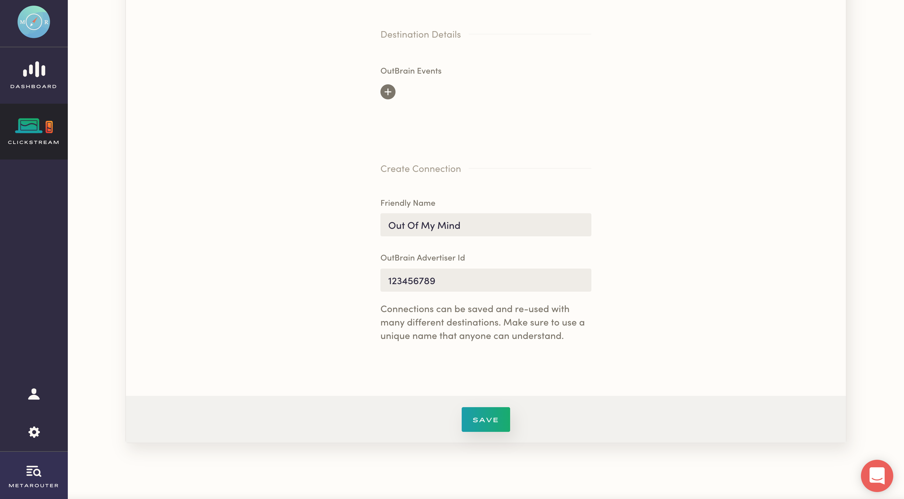

MetaRouter makes it easy to send your data to OutBrain. Once you follow the steps below, your data will be routed through our platform and pushed to OutBrain in the appropriate format.

## What is OutBrain and how does it work?

OutBrain is a major content discovery platform. The platform accesses dozens and recommends your content on dozens of publisher sites, including CNN, People, and ESPN. They'll make sure to capture audience attention to get your content as much exposure, engagement, and revenue as possible.

## Why send data to OutBrain with MetaRouter?

MetaRouter data will better leverage your use of the OutBrain platform, empowering you to better understand your users and more effectively provide them with engaging digital content.

[Learn more about OutBrain](https://www.outbrain.com/)

## Getting Started with OutBrain and MetaRouter

**\*Note:** This connector supports client-side analytics.js only. You also need to have instrumented MetaRouter [inside your website](../sources/analyticsjs.md) prior to enabling this connector.\*

### OutBrain Side

To get started sending events to OutBrain, all you're gonna need is your `Advertiser Id`, which you'll see as soon as you create your account and start a campaign.

### MetaRouter Side

Once you've identified your `Advertiser ID`, go ahead to your [MetaRouter dashboard](app.metarouter.io) and add OutBrain as a destination under your client-side connection.

Give your connection a unique name and input that `Advertiser ID` where asked.

Lastly, input the OutBrain events you want to track. This is something like: `email_sign_up`.

Click on `Save` at the bottom of the form to activate your pipeline.

Once your pipeline is activated, navigate over to the `Logs` or `Analytics` section to monitor live data.

With that - you're ready for insights!
