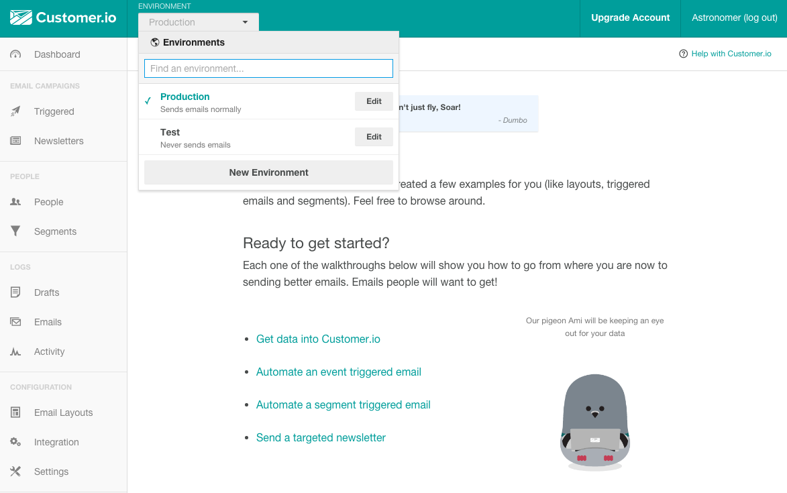
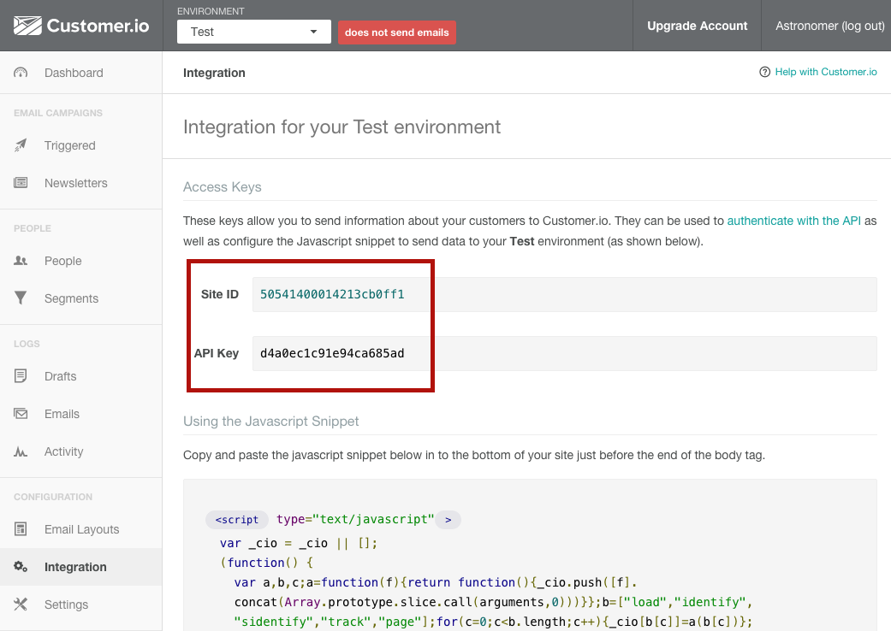
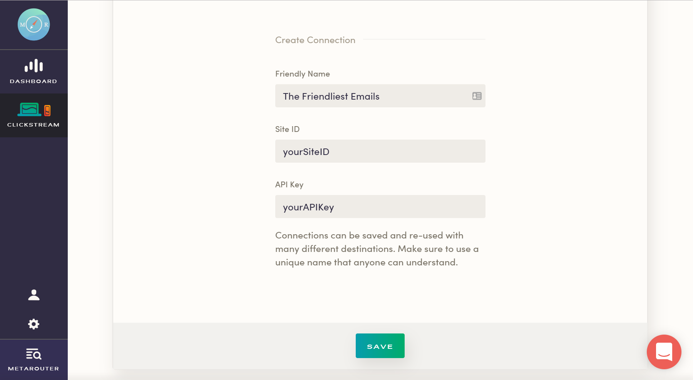

MetaRouter makes it easy to send your data to Customer.io. Once you follow the steps below, your data will be routed through our platform and pushed to Customer.io in the appropriate format.

## What is Customer.io and how does it work?

Customer.io is an automated email based on customer behavioral data. It allows you to create user segmentation by mapping this behavioral data. It also uses Shopify's open-source Liquid logic for powerful and robust email template and personalization options.

Using Customer.io involves placing their JavaScript snippet in the footer of your website and using their client libraries.

*Note that Customer.io accepts a maximum of 30 unique traits per identify call. If you have more than 30 traits attached to these calls, some will not be passed. Furthermore, Customer.io will only ingest a certain amount of data for each call sent to it. If you are not seeing specific attributes for the calls you are sending to Customer.io, ensure that you have not exceeded this limit.*

[Learn more about customer.io.](https://customer.io/)

## Why send data to Customer.io using MetaRouter?

If you elect to use the Customer.io JavaScript snippet, you'll need to manually identify logged in users and any information you know about them. After manually identifying these users, you will be able to email everyone who logs into your site. Customer.io also lacks libraries for Java, iOS, Android, and OS X.

Integrating Customer.io with MetaRouter allows the customer data coming in from websites, servers, and mobile applications to be sent directly to Customer.io without any additional installation. We eliminate the need for you to manually identify logged-in users.

## Getting Started with Customer.io and MetaRouter

### Customer.io Side

To get started sending events to Customer.io, you're going to need your Site ID and your API Key.

Once you create a [Customer.io](customer.io) account, you'll be asked to create an organization.

You will find both your Site ID and API Key clearly presented and labeled once you click on the 'Integration' tab within the 'Configuration' section of the left hand menu.

### MetaRouter

Add your Site ID and API Key into the Customer.io connector on your MetaRouter dashboard and give your new connection a unique name. Click 'Save' and your pipeline will be activated.

### Page

An example call would look like:

    analytics.page();

Page events will be sent to Customer.io as a `Page View` event where name and properties are optional. In the Customer.io “Activity View”, the event will have “Activity Type” set to “Page View” and “Activity Name” set to the page name. If no page name has been specified, “Activity Name” will default to the page URL.

### Identify

An example call would look like:

    analytics.identify('userId123', {
    email: 'john.doe@example.com'
    });

An email address is not required by Customer.io. It is only needed for people you intend to send email messages to (as opposed to SMS or push notifications). If you want an email to appear in the Customer.io “People View”, you must provide an email as a trait labeled `email`.

When you identify a new user, the user will be subscribed to Customer.io. If the user is already subscribed, the user attributes will be updated according to the traits provided.

To unsubscribe a user, simply pass in `user_id` and `unsubscribed` (with a value of true) in an `identify` call. Be sure the `user_id` and `email` match the values in Customer.io, which you can find in the “Overview” section under the “Attributes” column within an individual user’s view in the Customer.io UI. Here is an example of how to unsubscribe a user:

    analytics.identify('userId123', {
        email: 'john.doe@example.com',
        unsubscribed: true
      }
    )

### Track

An example call would look like:

    analytics.track('Clicked Button');

Track events will be sent to Customer.io as `custom events`. In the Customer.io “Activity View”, “Activity Type” will be set to `event` and “Activity Name” will be set to the event name.

## Best Practices

### Rate Limits

Customer.io has limits on the data collected by their API. To ensure your events arrive in Customer.io, please ensure that you are respecting the limits placed on the [Customer.io API](https://customer.io/docs/api/#api-documentationlimits).

## Troubleshooting

### No Events in Customer.io from the Browser

Remember that before we can send events to Customer.io from client-side Javascript the current user must be identified with their `userId`. The user’s email address can only be used to identify them if that is the id on record for them in Customer.io.

### Page events not being associated with user

Page events will only be associated to a user if the user has been previously identified in Customer.io. If you identify a user after making Page calls, the previous page events will not be associated to the user in Customer.io.

