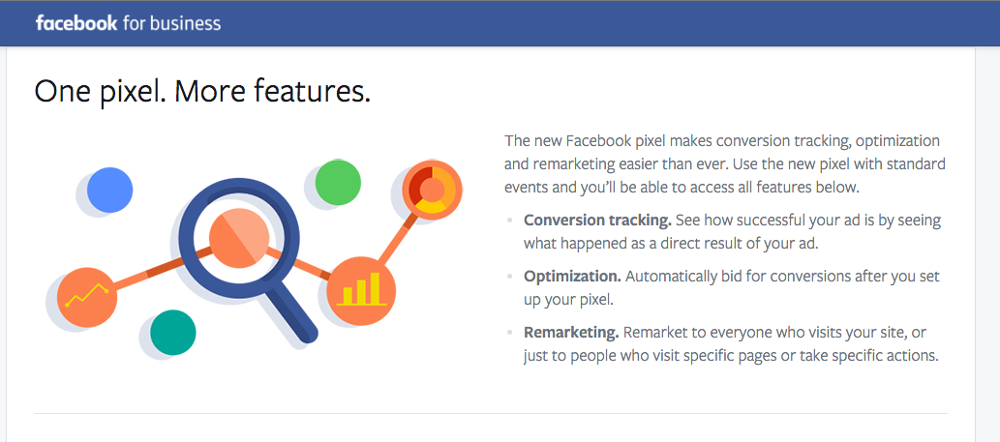
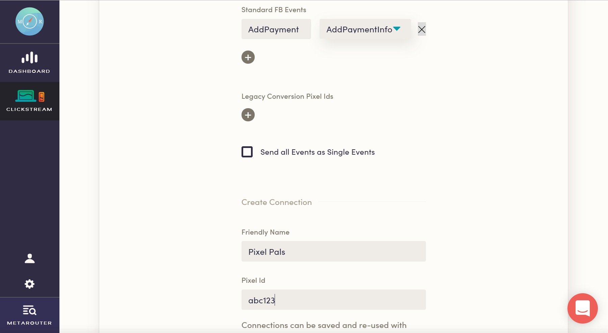
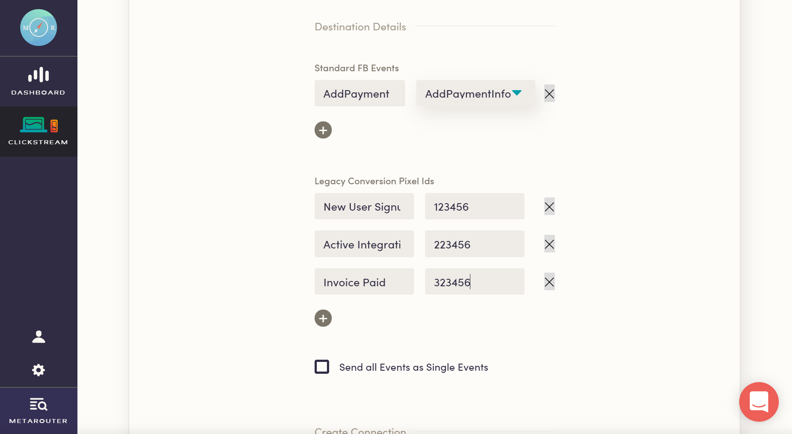

MetaRouter makes it easy to send your data to Facebook Pixel. Once you follow the steps below, your data will be routed through our platform and pushed to Facebook Pixel in the appropriate format.

**\*Note:** MetaRouter's Facebook Pixel destination consolidates what was previously Facebook's "Ads for Websites" suite, which consisted of both Facebook Custom Audiences and Facebook Conversion Tracking.\*

## What is Facebook Pixel and how does it work?

Facebook Pixel is an Ad system designed for conversion optimization and lead tracking. It allows you to manage all of your ads from one platform and uses prospecting tools to target your ads to lookalike audiences. By providing this dynamic service, Facebook Pixel allows marketers to optimize cross-platform ads for custom conversions and see when users view content, search for a product, interact with their wishlist, or add payment info.

Facebook Pixel uses a JavaScript Tag API to track audiences and custom user events like page visibility and page length. In order to be used, this JavaScript library must be added to every page of your site. It has a standard set of natively-integrated events such as product views, adds to cart, and purchases. While extremely extensible, tracking dynamic data like sku, name, and price from your database will require that custom code be added to your site.

## Why send data to Facebook Pixel using MetaRouter?

With MetaRouter, you can use Facebook Pixel without having to install their JavaScript library on every page of your site. We also eliminate the need to write custom code to track user event data. Once your Facebook Pixel is routed through MetaRouter, our platform translates page views and events into corresponding Facebook Pixel events.

## Getting Started with Facebook Pixel and MetaRouter

### Facebook Pixel Side

To get started with this integration, you'll first need to create a Facebook for Business account. [Follow the instructions](https://www.facebook.com/business/a/online-sales/custom-audiences-website) for creating a Pixel.

You'll only create one pixel for your site (typically labeled with the name of your business). This pixel will [replace all the functionality](https://www.facebook.com/business/help/1686199411616919) previously given to Facebook Audiences and Facebook Conversions (as well as allowing some additional features, such as custom conversions).

Once that's set up, identify your unique `pixelId`, a 15 digit number that uniquely identifies your site.

### MetaRouter Side

Put your Facebook Pixel ID into your MetaRouter account and give your new connection a unique name.

With that, just click `Save` to activate your pipeline.

### Additional Features

**Standard Events**

Facebook has nine [Standard Events](https://www.facebook.com/business/a/add-pixel-standard-events), which are predefined within the Facebook for Business platform.

To connect your events to these predefined ones within Facebook, just input the name of the MetaRouter event and choose the appropriate Standard Facebook Event that corresponds to it.

**Conversion Pixel ID**

If you are using the Facebook Pixel integration as a replacement for Conversion Pixels as well, put each `Conversion Pixel ID` into your MetaRouter account next to the corresponding event in MetaRouter that you've already set up. Make sure you include all capitals letters and spaces used in your event labels.

**Send all Events as Single Events**

Enabling this will force FB Pixel events triggered by MetaRouter to fire in trackSingle/trackSingleCustom mode to prevent them from going to other FB Pixels loaded on the page. This is helpful if there are different team managing their own pixel, or if you have installed analytics.js on a site with an existing pixel.

You can find out more about the specific use-case and benefits from this [Facebook Developers article](https://developers.facebook.com/ads/blog/post/2017/11/28/event-tracking-with-multiple-pixels-tracksingle/)

## Settings

### Map Categories to FB Content Types

If you’re using real estate, travel, or automotive [Dynamic Ads](https://www.facebook.com/business/learn/facebook-create-ad-dynamic-ads) you can map `category` values to `content_type` values. For example, you might map the category “cars” to the “vehicle” content type so Facebook promotes relevant vehicles from your catalog. To understand which content types you can map to, consult the [Facebook Dynamic Ads](https://developers.facebook.com/docs/marketing-api/dynamic-ad) documentation.

For most implementations we recommend leaving these mappings blank. By default, we’ll set content_type to “product”.

### Blacklist PII Properties

Facebook has a strict policy prohibiting any personally identifiable information (PII) from being sent as properties of events to their API. By default, this integration will scan `track` events for [these](https://docs.metarouter.io/v2/clickstream/destinations/facebook-pixel.html#pii-blacklisting) properties and strip them from the payload that gets sent to Facebook. If your events contain other properties with PII values, you can use this setting to append to this default list. You can also use this setting to optionally hash any PII values instead of dropping them.

### Client-Side Only: Advanced Match Trait Key for External ID

Please indicated a user trait key which you would like MetaRouter to use to send an `external_id` to Facebook Pixel using advanced matching. MetaRouter will use the value of this trait to map it to Facebook Pixel’s `external_id`.

### Legacy Conversion Pixel IDs

These are your [deprecated](https://developers.facebook.com/docs/facebook-pixel/implementation/custom-audiences) Conversion Pixel IDs from Facebook Conversion Tracking. Facebook will still accept data in this format, though it’s no longer possible to create conversion Pixel IDs. Now you create conversions based on standard and custom events inside their interface. Enter your event name in the left column and your pixel ID in the right column.

### Map Your Events to Standard FB Events

Enter your event on the left, and the Facebook standard event to map to on the right. Facebook recognizes certain [standard events](https://developers.facebook.com/docs/marketing-api/audiences-api/pixel#standardevents) that can be used across Custom Audiences, custom conversions, conversion tracking, and conversion optimization. When you map an event to a standard Facebook event, we’ll send the event by that name. Any unmapped events will still be sent as Custom Events.

### Pixel ID

Your Pixel ID, from the snippet created on the [Facebook Pixel creation page](https://www.facebook.com/ads/manager/pixel/facebook_pixel/).

### Standard Events custom properties

Add here all the custom properties you want to send as part of your Standard Events (Order Completed, Checkout Started, etc) as `property name`.

### Use UserId or Anonymous Id as External Id

Enable this setting if you want to send, `userId` (or `anonymousId` if not present) as external Id to Facebook.

### Value Field Identifier

For pre-purchase events such as `Product Viewed` and `Product Added`, choose which MetaRouter property you would like to map to Facebook’s value property.

### Whitelist PII Properties

By default, MetaRouter will strip any PII from the properties of `track` events that get sent to Facebook. If you would like to override this functionality, you can input each property you would like to whitelist as a line item in this setting. **Please reference our [documentation](https://docs.metarouter.io/v2/clickstream/destinations/facebook-pixel.html#pii-blacklisting) for the exact property names we filter out.**

## Troubleshooting

### PII Blacklisting

Facebook enforces strict guidelines around sending Personally Identifiable Information (PII) as properties of Pixel events. In order to adhere to these guidelines, MetaRouter will automatically scan `track` event properties for PII and remove any that get flagged from the event to Facebook. The following keys are currently filtered:

- email
- firstName
- lastName
- gender
- city
- country
- phone
- state
- zip
- birthday

Any `track` events with properties containing those keys will be sent to Facebook with those properties omitted.

If you have events that use any of those keys for non-PII properties, you can manually whitelist them using the **Whitelist PII Properties** setting. You may also add to this list and/or optionally hash blacklisted properties with the **Blacklist PII Properties** setting.

### Inconsistent or Missing Conversions

The most common reason for Facebook conversion pixels to fire inconsistently is that the page redirects or reloads before the pixel has time to be loaded on the page. Make sure your page does not redirect or reload for at least 300ms after the conversion event happens. In some cases a delay of 500ms is necessary.

We recommend using our `trackLink` or `trackForm` helpers to delay the page redirect. You can extend the delay by setting the timeout to 500ms.

### Extra or Duplicate Conversions

This may be due to conversion events being sent from your development, staging, or testing environments. We recommend setting up separate source for each environment. That way you can either point events to test conversion pixels in Facebook Conversion Tracking or turn off Facebook Conversion Tracking completely in non-production environments.

Double check that your mapped conversion events aren’t happening anywhere else on your site. If the user reloads the conversion page or re-triggers the tracked event they may be double counted.

Facebook’s conversion reports count view-through conversions as well as click-through conversions by default. You can change that setting inside Facebook Conversion Tracking in the report attribution settings.

### Facebook Conversions Not Matching Google Analytics

Facebook counts conversions per person, as opposed to Google Analytics which counts per browser cookie session (unless you’re using [Google Analytics User-ID](https://docs.metarouter.io/v2/clickstream/destinations/google-analytics.html#user-id)).

If someone saw or clicked on your ad on a mobile phone then later came back directly to purchase on a desktop machine Google Analytics wouldn’t know that this was the same person, but Facebook would. In that scenario Google Analytics counts 2 unique visits with a conversion last attributed to a direct visit on desktop. Facebook counts one conversion with the conversion properly attributed to the last ad click/view on mobile.

## Things to note

### What happens to revenue when an event goes to Facebook?

When our platform receives the `revenue` property within our schema, it will automatically map it to [Facebook Pixel's value property](https://www.facebook.com/business/help/392174274295227). This is to ensure that Facebook does not ignore any standard `revenue` property that would be in your events natively following our specification. Alternatively, including only `value` with eCommerce events will not make it to Facebook Pixel, as it doesn't match our specification it will not be mapped to the Facebook Pixel event properly.
