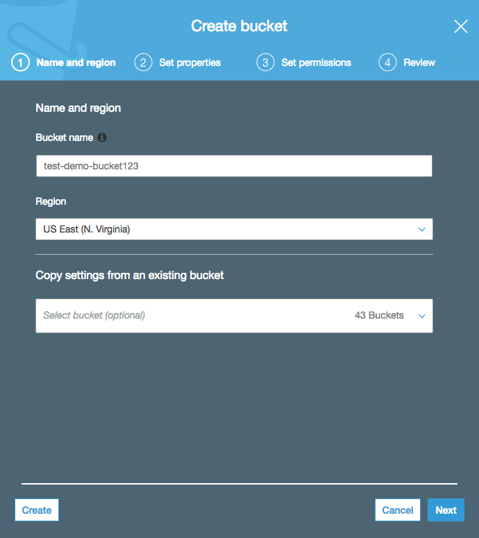
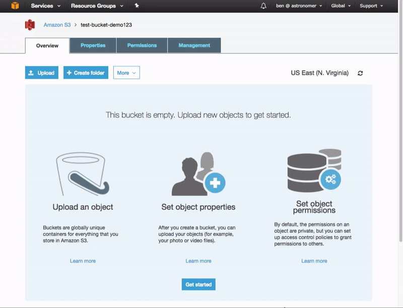
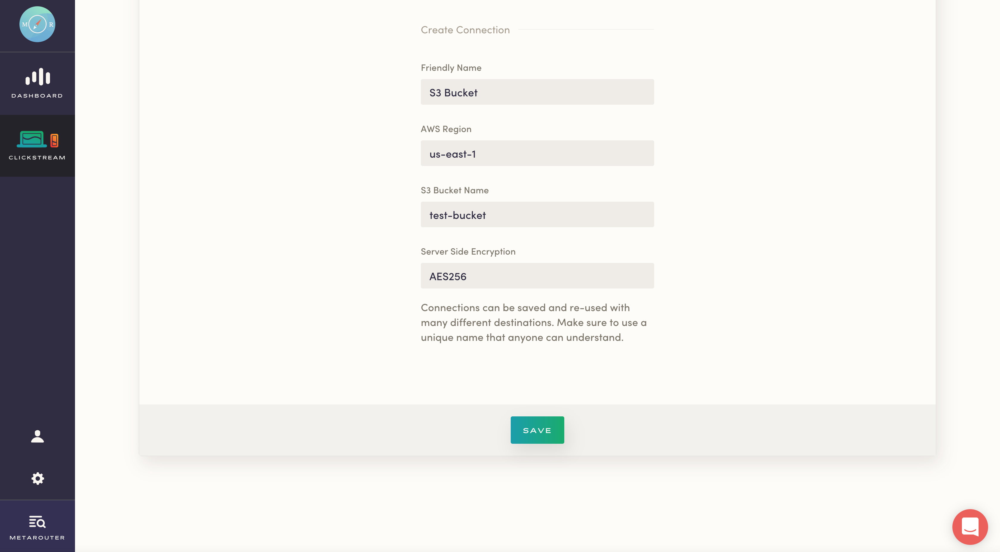

MetaRouter makes it easy to send your data to an Amazon S3 bucket. Once you follow the steps below, your data will be routed through our platform and pushed to Amazon S3 in the appropriate format.

## What is Amazon S3 and how does it work?

Amazon Simple Storage Service (S3) is a scalable web-based cloud storage service that allows you to store and retrieve data from anywhere at anytime. It offers an extremely flexible set of storage management and administration capabilities, supporting:

- SSL transfers and automatic encryptions for guaranteed data security
- Network-optimized, physical disk-based, or third-party connector methods for easy data imports and exports
- Object tagging for easy category customization

Getting data into your S3 bucket natively requires quite a bit of developer work; you'd need to use an analytics tool like [Google Analytics](google-analytics.md) and write an ETL pipeline to bring the data from that analytics tool to S3. This is inefficient in that it utilizes your engineering resources and dumps pre-formatted data into your S3 bucket rather than raw data.

## Why send data to Amazon S3 using MetaRouter?

Getting data to Amazon S3 ultimately leaves you with data that was designed to power reports within an analytics tool, not the raw data you need for custom analysis.

When you enable the Amazon S3 integration, raw data from MetaRouter automatically gets copied into your Amazon S3 bucket. Everything is stored as line-separated JSON objects, which each contains data from a single API called made to our platform.

MetaRouter spares you the headache of writing custom ETL pipelines to get your data into an S3 bucket.

## Getting Started with Amazon S3 and MetaRouter

MetaRouter makes it easy to copy broadcasted events to an [Amazon Simple Storage Service (S3) bucket](https://aws.amazon.com/s3/). You'll only need to configure the S3 Event Logs connector within your [MetaRouter dashboard](https://app.metarouter.io/), and include our bucket policy.

### Amazon S3 Side

#### Create an [Amazon S3 bucket](https://aws.amazon.com/s3/) within your AWS account.



**\*Note:** See below to confirm your region.\*

Once you create the bucket, create a folder labeled `MetaRouter-logs` inside of it.

#### Add our S3 Bucket Policy

Add the following S3 bucket policy, which will grant MetaRouter permission to copy events into your S3 bucket using `s3:PutObject`. In the `Resource:` line of each of the two policies below, swap out `YOUR_BUCKET_NAME` for the exact name of your S3 bucket, but keep the `/*` on the end.

```json
{
  "Version": "2012-10-17",
  "Id": "Policy1475027027703",
  "Statement": [
    {
      "Sid": "MetaRouterCopyAccess",
      "Effect": "Allow",
      "Principal": {
        "AWS": "arn:aws:iam::325517132571:user/s3-copy"
      },
      "Action": "s3:PutObject",
      "Resource": "arn:aws:s3:::YOUR_BUCKET_NAME/*"
    }
  ]
}
```



### MetaRouter Side

Navigate to the `Clickstream` pane and select the pipeline you would like to add this S3 storage destination to. Under `Destinations` click `New Destination`. Search for and select `S3 Event Logs`. Give your destination a name and optionally fill in the `Prefix` where the file keys will be stored.

Either configure a new S3 connection in your MetaRouter dashboard with a unique name or use an existing one. This connection holds your `AWS Region`, `Bucket Name`, and `Server Side Encryption` (as needed). Click `Save` to activate your pipeline.

### Things to Note:

1. _AWS Region (required)_
   The region in which your S3 bucket resides. You can find a list of regions for [Amazon S3 under the "Region" column here](http://docs.aws.amazon.com/general/latest/gr/rande.html#s3_region). Enter your region exactly as it's shown (i.e. `us-east-1`).

2. _Server Side Encryption (optional)_
   AWS S3 supports [server side encryption](http://docs.aws.amazon.com/AmazonS3/latest/dev/UsingServerSideEncryption.html). If your bucket policy requires the server side encryption header to be set, you can specify that here. Example values for this field are 'AES256' or 'aws:kms'.

3. _Path Prefix (optional)_
   The file path at which your S3 events will be stored.


