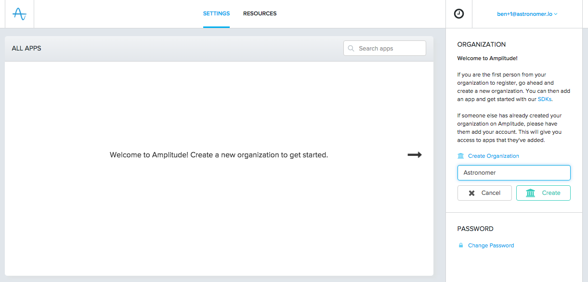

Astronomer Clickstream makes it easy to send your data to Amplitude. Once you follow the steps below, your data will be routed through our platform and pushed to Amplitude in the appropriate format. 

## What is Amplitude and how does it work?

Amplitude is a behavioral data analytics tool that enables real-time cross-platform analytics so that marketers can view user activity on a dashboard. It also funnels audiences by custom events and actions like checkout completed, item added to cart, or payment entered. It integrates very nicely with Amazon Redshift for data access so that data scientists can analyze user drop off over time.

Implementing Amplitude natively in your stack requires a good amount of developer work; sending them user data requires mapping out your events and user traits to be collected and deciding which libraries and SDKs you'll need ot use. You'll then need to install your libraries and SDKs of choice on all of your products.

[Learn more about Amplitude](https://amplitude.com/)

## Why send data to Amplitude using Astronomer Clickstream?

If you want to try out any other analytics application, implementing native event tracking for Amplitude is a waste of time. Going through the processes of selecting and installing libraries and SDKs just for one tool will take your engineers a lot of time. Furthermore, if you plan to add more tools to your stack, the event tracking and custom coding work is going to be redundant and frustrating.

Integrating Amplitude with Astronomer Clickstream means that you will just need to install Astronomer and enable Amplitude in your Astronomer UI. You will only need to set up one event tracking libarary (Astronomer's), and then you will be able to route and send data to Amplitude and any other destination of your choice without writing custom code for each one.

## Getting Started with Amplitude and Astronomer Clickstream

### Amplitude Side

To get started sending events to Amplitude, all you need is your API Key. After signing up for an Amplitude account, a page will load asking you to create an organization.

You will then be prompted to create your first app. This app will function as your project to recieve events from Astronomer.

After this app is created, an API Key will be generated and presented in your dashboard. 

### Astronomer Side

Add this API Key to the Amplitude connector on the Astronomer dashboard and give your new connection a unique name. Your pipeline will be activated once you click 'Create Destination.'

You can now go back into your amplitude account and see your user activity! To see exactly what events are being sent over, you can click around the 'Events' and 'User Activity' tabs.

