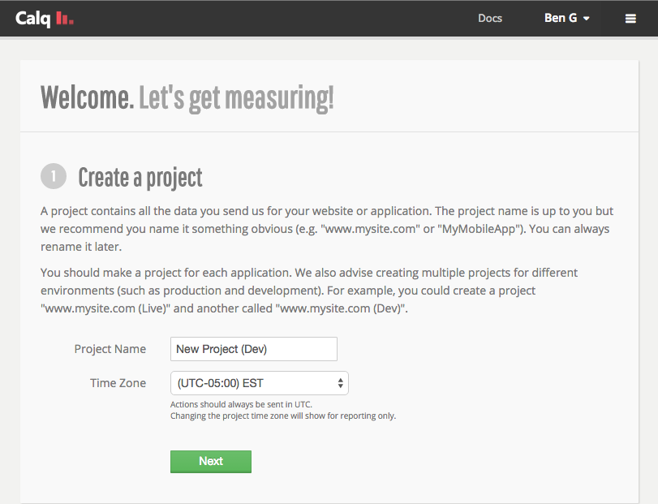
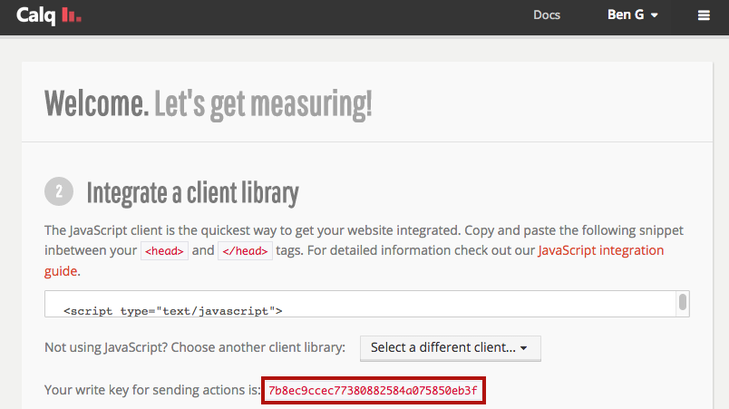
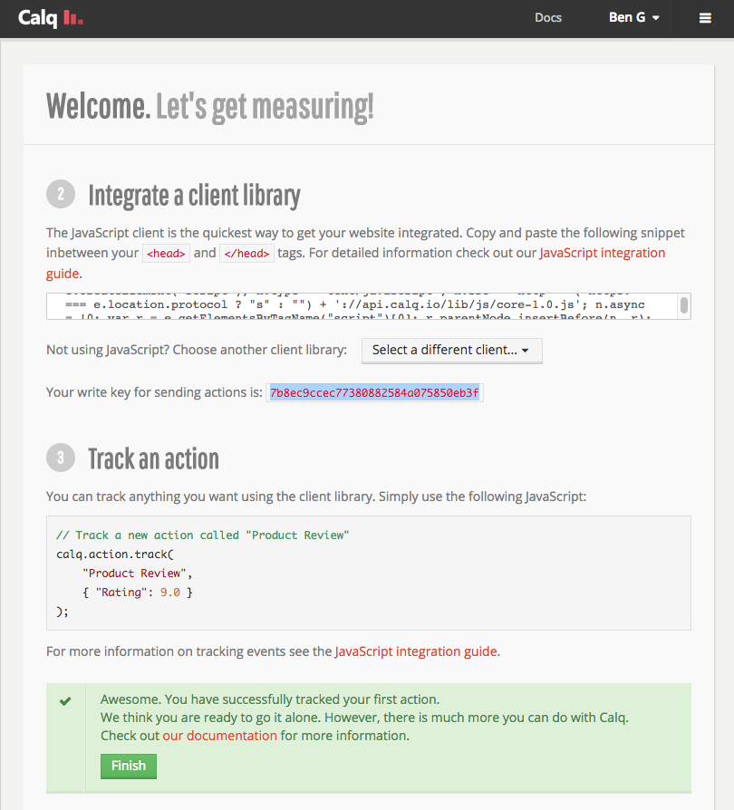

Astronomer Clickstream makes it easy to send your data to Calq. Once you follow the steps below, your data will be routed through our platform and pushed to Calq in the appropriate format. 

## What is Calq and how does it work?

Calq is a custom analytics tool for mobile and web applications. It supports custom funnels to provide marketers with visibility into user flow and user drop off. On top of those custom funnels, Calq enables retroactive funnels, allowing marketers to analyze historical actions such as products viewed, products added to cart, and pages viewed. It generates real-time reports that live-stream customer actions and provides query builders. It also allows developers to create custom properties and queries using "Action Query Language," which is similar to SQL.

Sending data to Calq requires the use of the Calq API, which is done via implementation of their SDKs. Implementing these collection methods requires manual additions to your application client or server code.

[Learn more about Calq](https://calq.io/)

## Why send data to Calq using Astronomer Clickstream?

Installing Calq as a standalone tool in your stack will require carefully mapping out your events and user traits to be collected. You'll also need to evaluate and learn how to use Calq's SDKs or API endpoints to collect the data and implement these packages into your products.

Integrating Calq with Astronomer Clickstream means that you won't need to install a Calq SDK or access their API, as Astronomer is able to collect and route information directly to Calq. Plus, our integration requires no changes to your code, making it even simpler to get started with Calq. You'll reap the benefits of tracking directly with Calq without any of the time, labor, and application load costs associated with adding new tracking code into your current applications.

## Getting Started with Calq and Astronomer Clickstream

### Calq Side

Once you create an account with Calq, you'll be asked to create a new project.

After you create a new project, you will be given a write key. 

### Astronomer Side

Copy this key and add it into your Astronomer UI to get started. Click 'Create Destination' to activate your pipeline.

If you look back at your Calq account, you should see a message confirming that events have been received.

