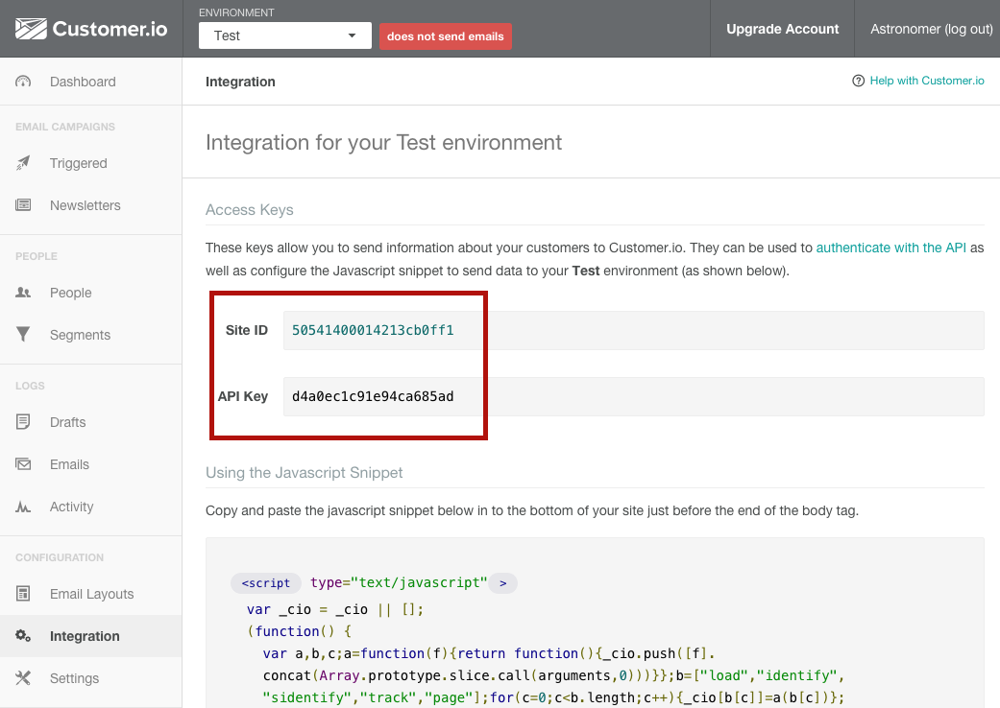

Astronomer Clickstream makes it easy to send your data to Customer.io. Once you follow the steps below, your data will be routed through our platform and pushed to Customer.io in the appropriate format. 

## What is Customer.io and how does it work?

Customer.io is an automated email based on customer behavioral data. It allows you to create user segmentation by mapping this behavioral data. It also uses Shopify's open-source Liquid logic for powerful and robust email template and personalization options. 

Using Customer.io involves placing their Javascript snippet in the footer of your website and using their client libraries. 

[Learn more about customer.io.](https://customer.io/)

## Why send data to Customer.io using Astronomer Clickstream?

If you elect to use the Customer.io Javascript snippet, you'll need to manually identify logged in users and any information you know about them. After manually identifying these users, you will be able to email everyone who logs into your site. Customer.io also lacks libraries for Java, iOS, Android, and OS X.

Integrating Customer.io with Astronomer Clickstream allows the customer data coming in from websites, servers, and mobile apps to be sent directly to Customer.io without any additional installation. We eliminate the need for you to manually identify logged-in users.

## Getting Started with Customer.io and Astronomer Clickstream

### Customer.io Side

To get started sending events to Customer.io, you're going to need your Site ID and your API Key.

Once you create a [Customer.io](customer.io) account, you'll be asked to create an organization.

You will find both your Site ID and API Key clearly presented and labeled once you click on the 'Integration' tab within the 'Configuration' section of the left hand menu.

### Astronomer Side

Add your App ID into the Customer.io connector on your Astronomer dashboard and give your new connection a unique name. Click 'Create Destination' and your pipeline will be activated.

