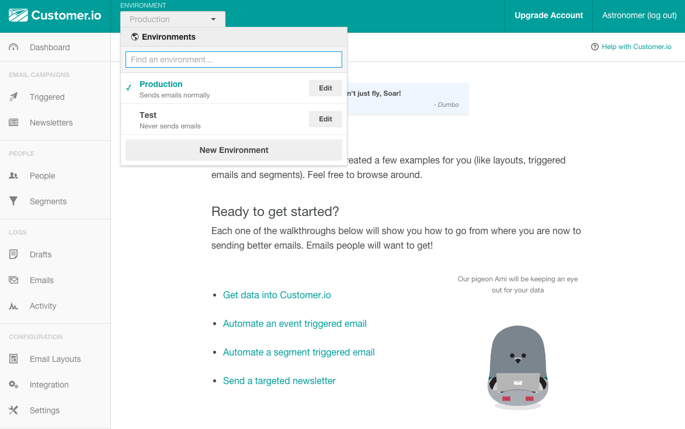
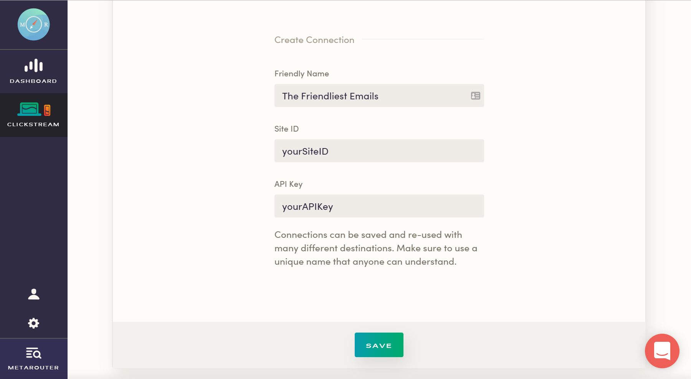

MetaRouter makes it easy to send your data to Customer.io. Once you follow the steps below, your data will be routed through our platform and pushed to Customer.io in the appropriate format.

## What is Customer.io and how does it work?

Customer.io is an automated email based on customer behavioral data. It allows you to create user segmentation by mapping this behavioral data. It also uses Shopify's open-source Liquid logic for powerful and robust email template and personalization options.

Using Customer.io involves placing their JavaScript snippet in the footer of your website and using their client libraries.

*Note that Customer.io accepts a maximum of 30 unique traits per identify call. If you have more than 30 traits attached to these calls, some will not be passed. Furthermore, Customer.io will only ingest a certain amount of data for each call sent to it. If you are not seeing specific attributes for the calls you are sending to Customer.io, ensure that you have not exceeded this limit.*

[Learn more about customer.io.](https://customer.io/)

## Why send data to Customer.io using MetaRouter?

If you elect to use the Customer.io JavaScript snippet, you'll need to manually identify logged in users and any information you know about them. After manually identifying these users, you will be able to email everyone who logs into your site. Customer.io also lacks libraries for Java, iOS, Android, and OS X.

Integrating Customer.io with MetaRouter allows the customer data coming in from websites, servers, and mobile applications to be sent directly to Customer.io without any additional installation. We eliminate the need for you to manually identify logged-in users.

## Getting Started with Customer.io and MetaRouter

### Customer.io Side

To get started sending events to Customer.io, you're going to need your Site ID and your API Key.

Once you create a [Customer.io](customer.io) account, you'll be asked to create an organization.

You will find both your Site ID and API Key clearly presented and labeled once you click on the 'Integration' tab within the 'Configuration' section of the left hand menu.

### MetaRouter

Add your Site ID and API Key into the Customer.io connector on your MetaRouter dashboard and give your new connection a unique name. Click 'Save' and your pipeline will be activated.

