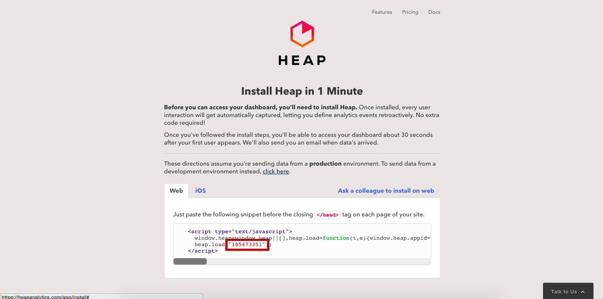
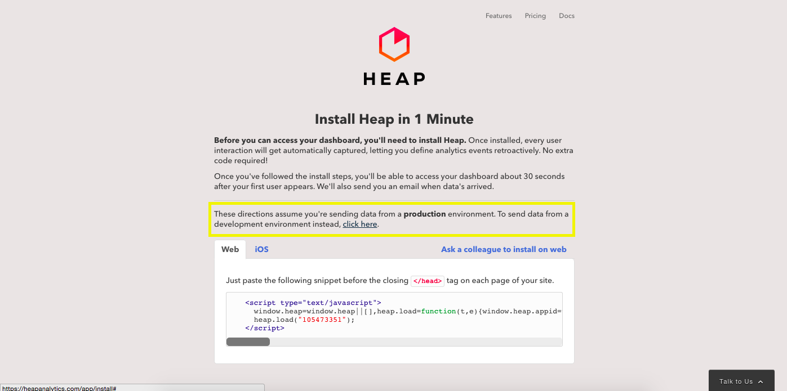
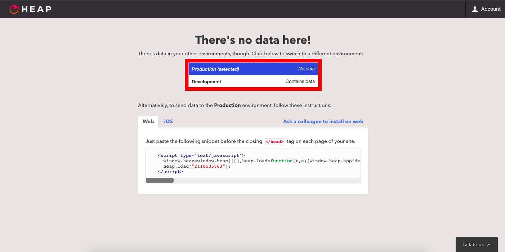
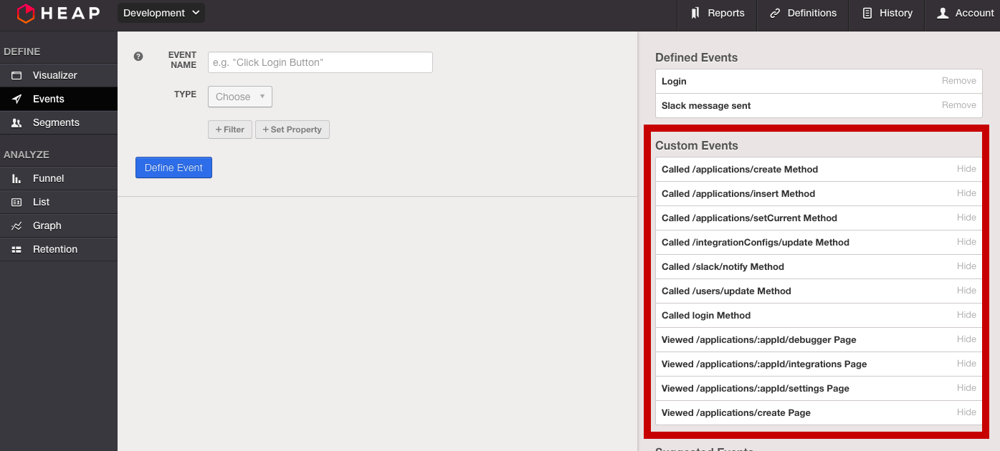

Astronomer Clickstream makes it easy to send your data to Heap. Once you follow the steps below, your data will be routed through our platform and pushed to Heap in the appropriate format. 

## What is Heap and how does it work?

Heap is a mobile and web analytics tool that automatically captures every user action in your web or mobile app with no need for extra code. Heap allows direct SQL access to your Heap data both in real-time and retroactively, equipping your team for holistic analysis. 

Designed with marketers in mind, Heap supports point-and-click web and mobile tag creation, offers event visualizers, clean graphics, funnel data, and retention stats. 

Heap is powered by a Javascript library that you'll need to install on every page that you want to track. This library collects all actions and some basic contextual information, including CSS selectors and text on your links and buttons. If you want to go deeper than this basic information, you'll need to write custom code into your site using the Heap Javascript API. Similarly, if you want to record events that happen when users aren't actively on your site, such as when someone makes a payment or opens an email, you'll need to write code to pull that data and send it to Heap's API. 

[Learn more about Heap](https://heapanalytics.com/features/sql)

## Why send data to Heap using Astronomer Clickstream?

Integrating Heap with Astronomer Clickstream allows you to collect valuable data without manually adding the Heap code snippet into your site header. All you have to do is enable the Heap destination in your UI and Astronomer will take care of translating user traits and sending them to Heap. 

## Getting Started with Heap and Astronomer Clickstream

### Heap Side

Once you create a Heap account, a page will load suggesting that you install Heap into your app. If you're using Astronomer for a web app, this isn't necessary as you'll be able to copy over the Source ID into your Astronomer account. Your Source ID will be located at the end of the javascript snippet they provide with the `heap.load()` function.

It's important to note here that Heap automatically sets you up with a Development and Production project when you create an account. Make sure you're copying over the right ID as that will affect which project within Heap your data gets sent to.

### Astronomer Side

Add your Source ID into the Heap connector on your Astronomer dashboard and give your new connection a unique name. Click `Create Destination` and your pipeline will be activated.

### Things to Note. 

When you return to your Heap account, you might get a message saying "There's no data here!" Your data might be in a different environment, so make sure to check all places (i.e. development instead of production).

To see what specific events are coming in, go to the `Events` page on the left-hand menu bar.

