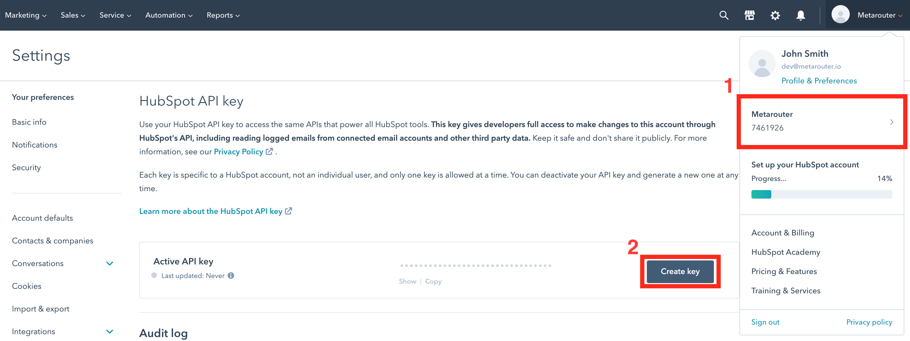
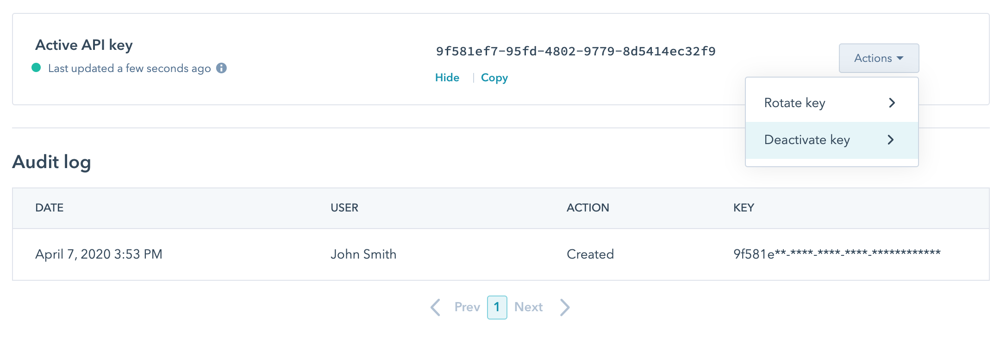
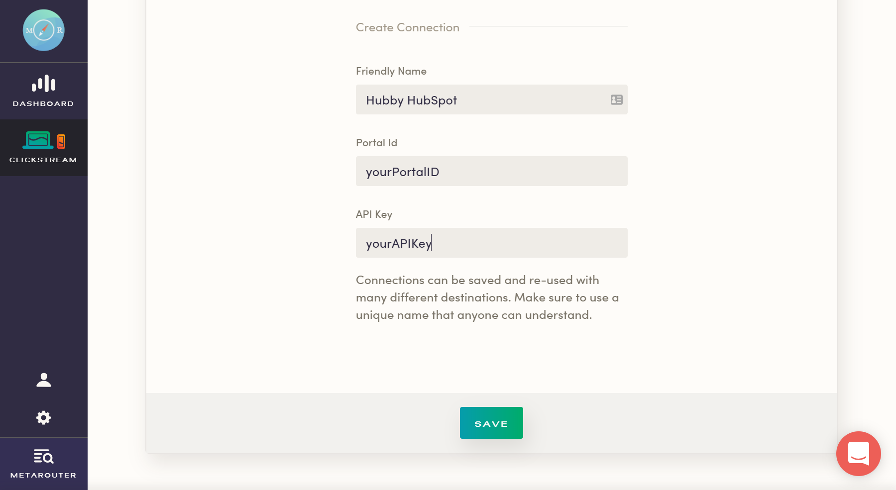

MetaRouter makes it easy to send your data to HubSpot. Once you follow the steps below, your data will be routed through our platform and pushed to HubSpot in the appropriate format.

## What is HubSpot and how does it work?

HubSpot is an inbound marketing and sales software that helps companies attract visitors, convert leads, and close customers.

The marketing automation platform includes everything from a landing page builder to SEO tools as well as a repository for managing specific campaign leads.

HubSpot also monitors social media engagement and tracks the ROI of advertising on major social media platforms, equipping your team with the data you need to make strategic marketing decisions and investments.

Often used in tandem with another CRM like Salesforce, HubSpot integrates multiple platforms into source of truth.

[Learn more about HubSpot](https://www.hubspot.com/)

## Why send data to HubSpot using MetaRouter?

Using HubSpot with MetaRouter allows you to automatically keep all of the customer data in your HubSpot account up-to-date and accurate, rather than spending valuable time uploading lists or relying on lead forms to capture contacts. By enabling the HubSpot integration in your MetaRouter UI, you can keep all customer data records synced and up-to-date across multiple systems in real time.

## Getting Started with HubSpot and MetaRouter

To get started sending events to [HubSpot](http://www.hubspot.com), all you'll need is your Portal ID and API, both of which can be found shortly after you create an account.

### Hubspot Side

Create a HubSpot account via their [website](http://www.hubspot.com).

After you go through the initial onboarding, click on your account tab on the top right of the window. Here you will find your Portal ID (1) as a number below your organization name.

Now, go to `Settings` and from the left side panel go to `Integration` -> `API key`.

Here you will be able to create a new API key (2).

One handy feature of HubSpot is the full API Key History, including creation, viewing, and deactivation dates.

### MetaRouter Side

Now, all you have to do is add both of these credentials (your Portal ID and your newly created API Key) into the MetaRouter UI and give your new connection a unique name.

Once you do that, just click `Save` to activate your pipeline.
