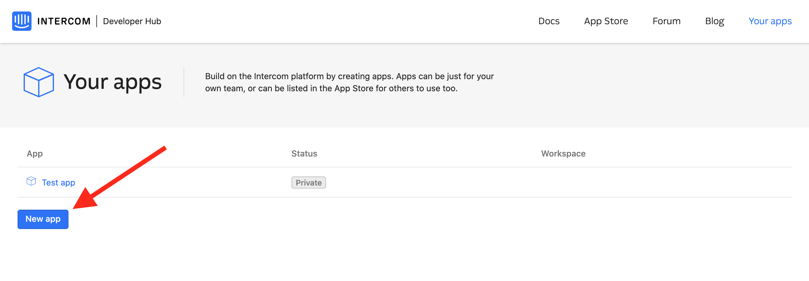
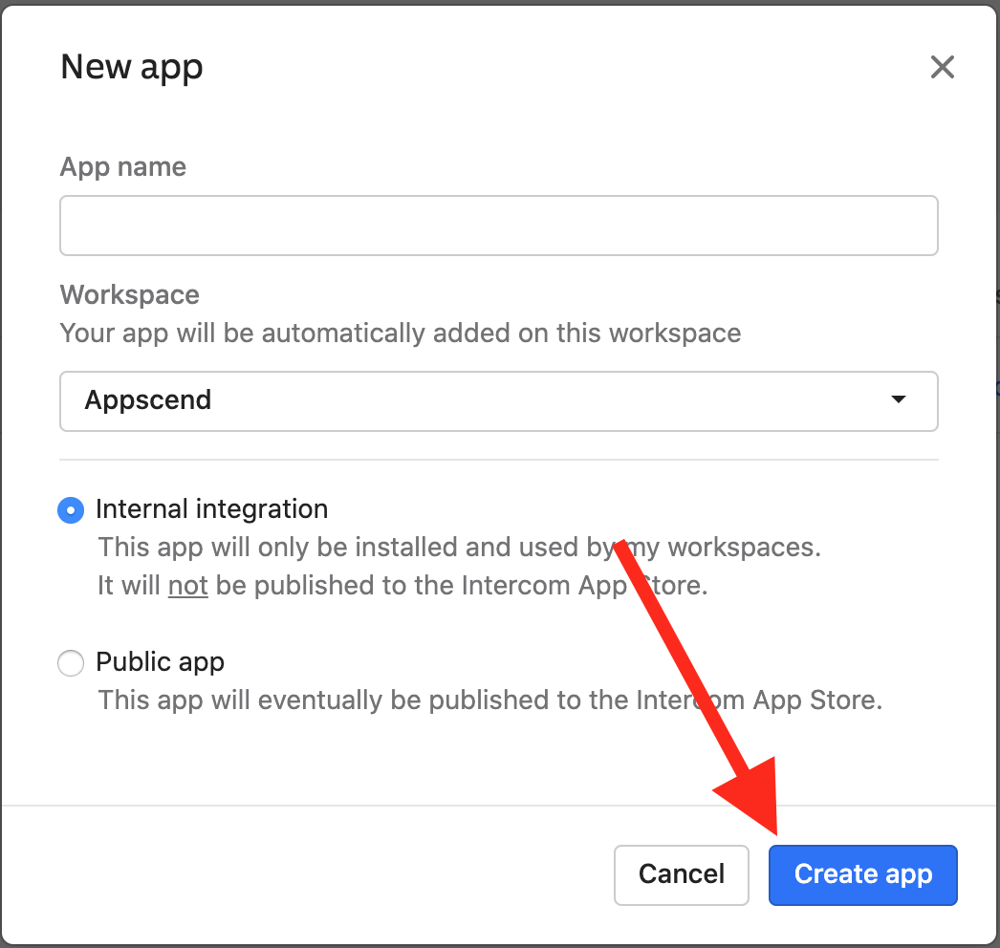
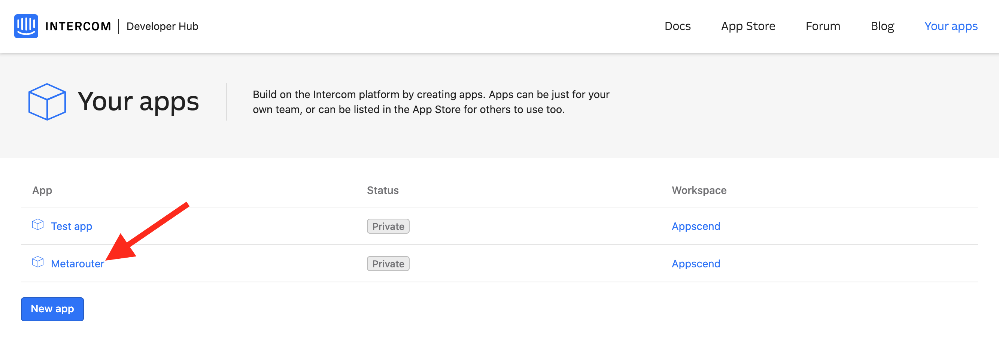
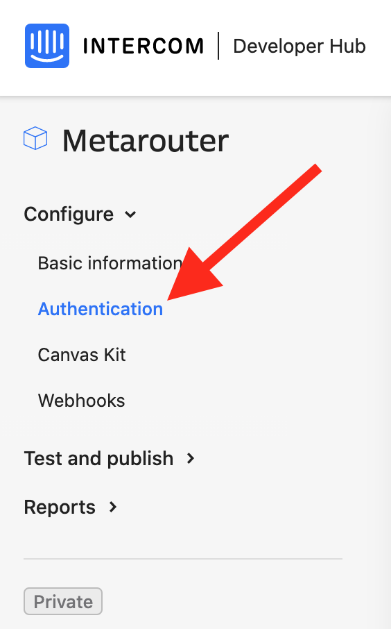
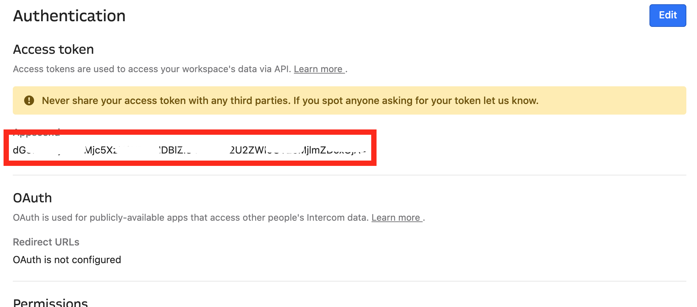
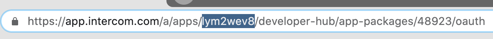
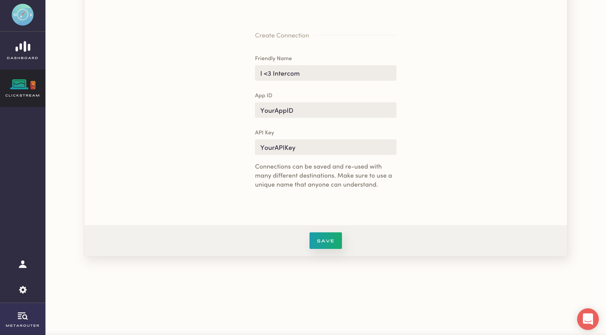
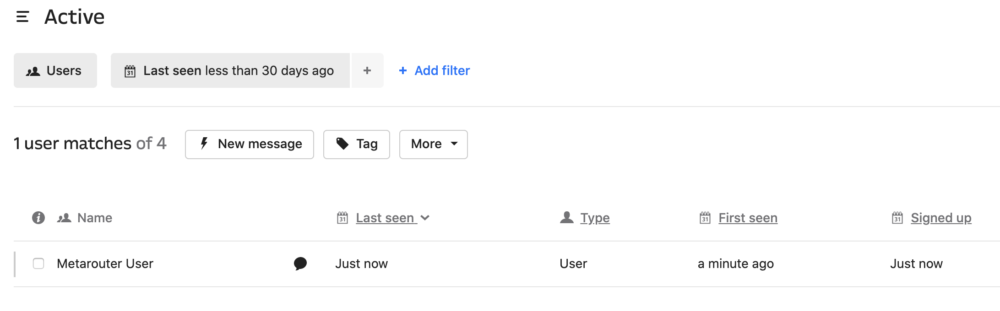
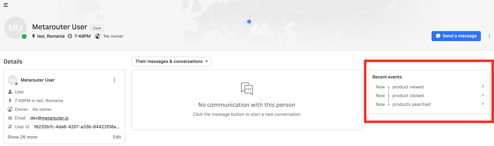

MetaRouter makes it easy to send your data to Intercom. Once you follow the steps below, your data will be routed through our platform and pushed to Intercom in the appropriate format.

## What is Intercom and how does it work?

Intercom is a customer messaging platform, providing in-app messaging for onboarding and support. It targets chat, email, and in-app messages based on user behavior.

Intercom requires that a JavaScript snippet be added to your site or that you use the appropriate SDK for iOS and Android. If you want to send data directly into Intercom, you'll need to implement custom event tracking in your site.

## Why send data to Intercom using MetaRouter?

Integrating Intercom with MetaRouter allows you to immediately begin messaging customers based on their behavior. We also eliminate the need to home-brew a solution that tracks user events to Intercom.

## Getting Started with Intercom and MetaRouter

### Intercom Side

Log into your account in the Intercom Developer Hub and go to Your apps page


Click on the **New App** button



 Fill the App name, select an workspace and check the Internal integration option. When you're ready, click the **Create app** button.



Click on the newly created app to open its page



Select **Configure** and then **Authentication**



You will now find the API Key under the workspace's name in which the app belongs



Also, the App ID will be located in the URL, right after the `app.intercom.com/a/apps/` part of the URL



### MetaRouter Side

Enter your App ID and API Key into the Intercom connector on your MetaRouter dashboard.

Give your new connection a unique name.

Click `Save` to activate your pipeline.



At this point, you'll see events coming in to your Intercom account. If you go to [app.intercom.com](https://app.intercom.com), you'll see 1 new user. That's you!



Click on that new user to see the history of events being recorded.



### Additional Features

#### Disassociating Users from a Company (server-side only)

You can disassociate a user from a company by passing in a field inside the `company` trait with `remove: true` in your `identify` calls.

#### Identity verification plus filtering via Destinations Object

If you're using Intercom identity verification AND the `selective destinations functionality`, the context object will look like this:

```
{
     integrations: {
         All: false,
         Intercom: {
            user_hash: '<%= OpenSSL::HMAC.hexdigest("sha256", "YOUR_INTERCOM_APP_SECRET", current_user.id) %>'
         }
     }
}
```

#### Unsubscribe Users

With MetaRouter, you can unsubscribe users from email by setting a flag from `server side` libraries `unsubscribedFromEmails`, inside `context` object.

`node.js` example:

```
analytics.identify({
  userId: '4832094283057439285723523452345',
  anonymousId:'43254364571',
  context:{
    Intercom: { unsubscribedFromEmails: true }
  },
  traits: {
    firstName: 'John ',
    lastName: 'Jacob',
    email: 'jingleheimer@schmidt.com'
  }
});
```
***Note:** This will only work from server side libraries and mobile, NOT for analytics.js.*

#### Rich Link Properties

To use Intercom’s Rich Link object, list the name of the exact MetaRouter property name and make sure the value of those properties only include `url` and `value` keys.
