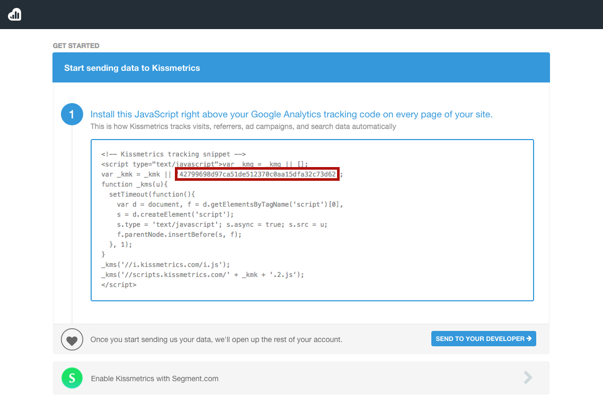
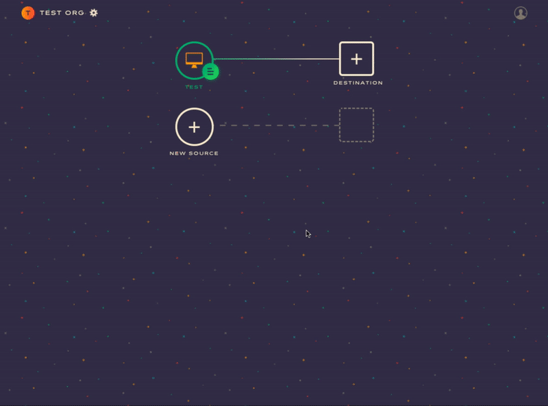
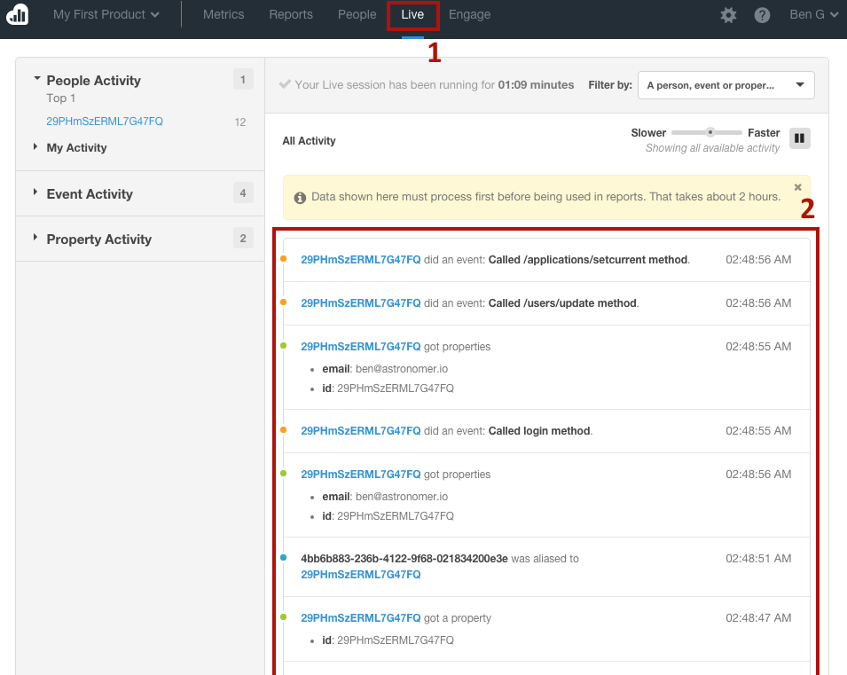

Astronomer Clickstream makes it easy to send your data to KISSmetrics. Once you follow the steps below, your data will be routed through our platform and pushed to KISSmetrics in the appropriate format. 

## What is KISSmetrics and how does it work?

KISSmetrics is a customer engagement automation suite that combines behavioral analytics, segmentation, and email campaign automation to deeply understand and engage your customers. 

Access "out-of-the-box" behavior reports across platforms, track your key growth segments, and deliver behavior-based, automated emails to keep your users engaged. 

Even more high level, KISSmetrics gives marketers insight to custom population behavior for both active and churned populations.

To install KISSmetrics itself, you ahve to : 

- 1. Map out the events and user traits to be collected
- 2. Decide which libraries and SDKs you need to collect that data 
- 3. Install them into your products. 

KISSmetrics event reporting is easy to use if your events are properly planned following best practices, but the initial work does take some work and due diligence. 

*Note:* If you'er planning on setting up any tool that requires event data, make sure to evaluate whether it's worth your developers' time.

## Why send data to KISSmetrics using Astronomer Clickstream?

Using Astronomer to send data to KISSmetrics ensures that your developers only need to implement one platform and learn two simple calls: `identify` and `track`. With Astronomer, your customer data will not only be sent to KISSmetrics directly, but also to internal tools like email and chat. 

With Astronomer, skip the need for custom code and benefit from additional customer data. 

## Getting Started with KISS metrics and Astronomer Clickstream

### KISSmetrics Side

Once you have a Kissmetrics account, get started sending events to Kissmetrics. You'll need your:

- Project ID
- Your Write Key
- API Key 

The Project ID is what tells Astronomer which project within Kissmetrics are yours and the Write Key gives Astronomer permission to send data into it. Both will be long strings of random characters (the ID will be 24 characters and the Write Key will be 224.)

See the below for more details on how to find your API key. This will be a 40 character string found in the javascript snippet that they suggest adding to your app. 

### Astronomer Side 

Now that you have your API Key, go ahead and enter it into the Kissmetrics connector on your Astronomer dashboard and give your new connection a unique name. 

Once that's done, click on `Create Destination` to activate your pipeline.

### Final Step.

Click around your app to send off some test events. It might take an hour or so for events to start populating into your project. You can check to see if events are coming in by clicking on the `Live` tab at the top of the page and looking at the `All Activity` section.

