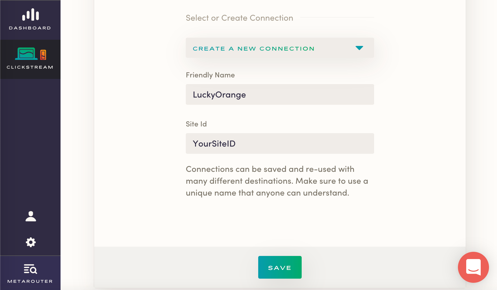
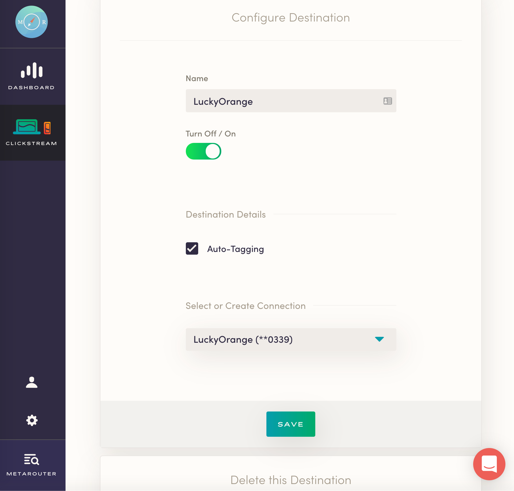
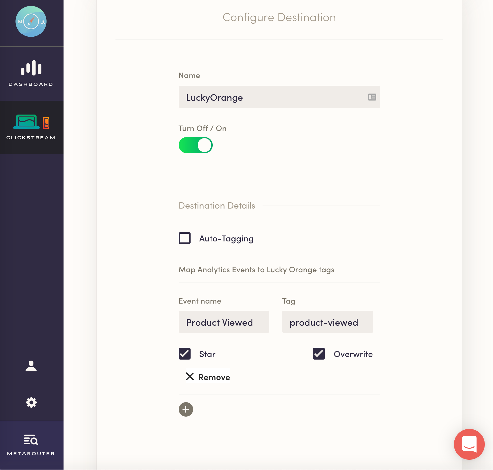

MetaRouter makes it easy to send your data to [Lucky Orange](https://www.luckyorange.com/). Once you follow the steps below, your data will be routed through our platform and pushed to Lucky Orange in the appropriate format.

## What is Lucky Orange and how does it work?

Lucky Orange lets you see users on your site and interact with them in many ways. With Lucky Orange, you can chat with visitors on your site, watch their mouse movements (eye tracking) on the screen, and scroll depth, clicks in real time, play them back as recording, generate heat maps of clicks, create quick polls, and more.


## Why send data to Lucky Orange using MetaRouter?

With MetaRouter, you can use Lucky Orange without having to install their JavaScript library on every page of your site. We also eliminate the need to write custom code to track behavior tags. Once your Lucky Orange is routed through MetaRouter, our platform translates page views and events into corresponding Lucky Orange events.

## Getting Started with Lucky Orange and MetaRouter

To get started sending events to Lucky Orange, first sign up for [an account](https://www.luckyorange.com/).

***Note**: Lucky Orange is available as a client-side destination only.*

### Lucky Orange Side

Begin by logging into your [Lucky Orange](https://www.luckyorange.com/) account. Create a new site by clicking `Add a New Site` button from top right. The next page will show your Lucky Orange tracking code for your site.


The generated Lucky Orange tracking code contains your site id (shown blured in the above image). Copy this value.

***Note**: You can always grab this value by accessing Settings > General.*

### MetaRouter Side

Back in the MetaRouter UI, select Lucky Orange as a destination and give your new pipeline a unique name. Add your Site Id into the Lucky Orange connector on your MetaRouter dashboard and give your new connection a unique name.



This settings page allows you to connect an [e-commerce event](https://docs.metarouter.io/v2/clickstream/ecommerce.html) with a Lucky Orange tag - you don't need to create the behavior tag on you Lucky Orange dashboard, triggering an event will automatically assign it the tag you defined on the MetaRouter dashboard.

To map an event to a specific tag, go to the *Map Analytics Events to Lucky Orange tags* section of the settings page and click the **+** button. The values that you can add here are the following:

* Event name (required) - the name of your analytics.js event
* Tag (required) the name of your Lucky Orange tag
* Star - by checking this box, the triggered tag will be starred on Lucky Orange
* Overwrite - by checking this box, the triggered tag will overwrite any existing tags



You can map as many events you need.

Finally, click `Save` to activate your pipeline.

#### Identify
If you haven't had a chance to review our spec, please take a look to understand what the [Identify method](https://docs.metarouter.io/v2/clickstream/calls.html#identify) does. An example call would look like:

```javascript
analytics.identify("1205119", {
  name: "Dagny Smith", 
  email: "dagny@metarouter.io", 
});
```

Calling identify will create and update visitors in Lucky Orange. All traits to Lucky Orange and each trait will create a new column in the visitor view. If name and email are set in an identify call, Lucky Orange will also try to find an Gravatar associated with the user.



#### Track
If you haven't had a chance to review our spec, please take a look to understand what the [Track method](https://docs.metarouter.io/v2/clickstream/calls.html#track) does. An example call would look like:

```javascript
analytics.track("Your Event Name", {});
```

Calling track will create or use an already existing Lucky Orange behavior tag bassed on your defined mapping. If an event is triggered and there's no corresponding mapping for it, it won't reflect on Lucky Orange's dashboard.


With that, you're all set! Get ready for insights.