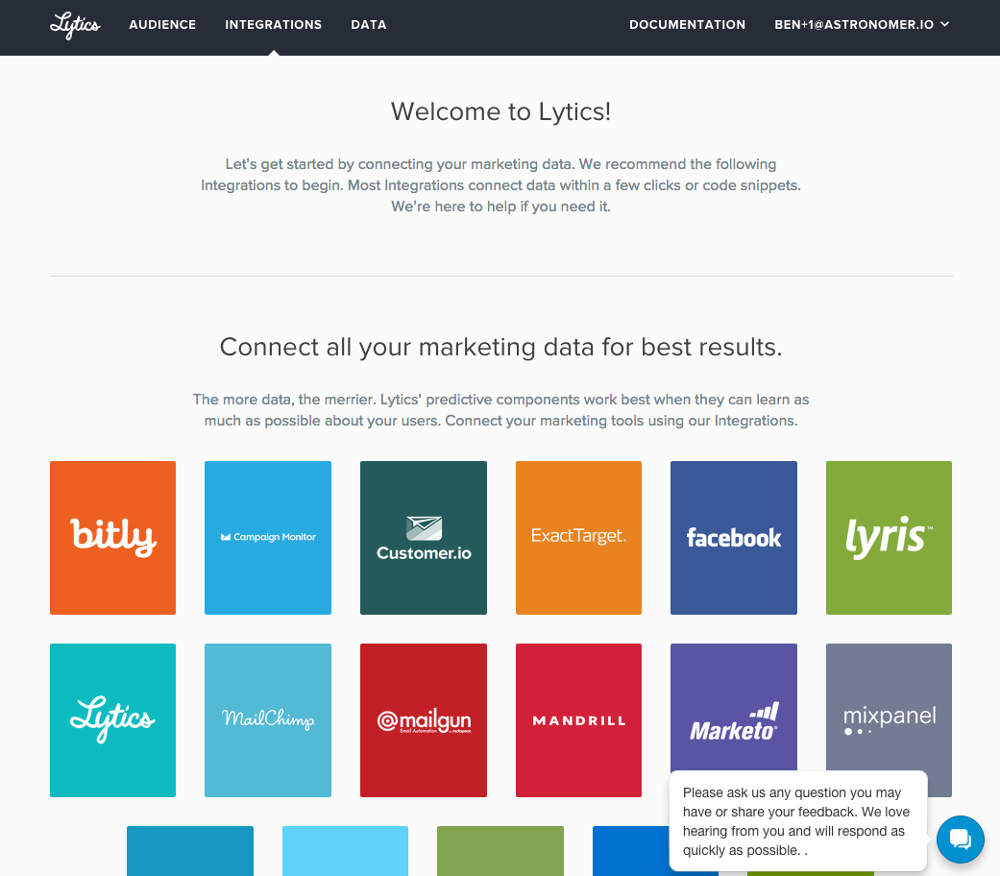
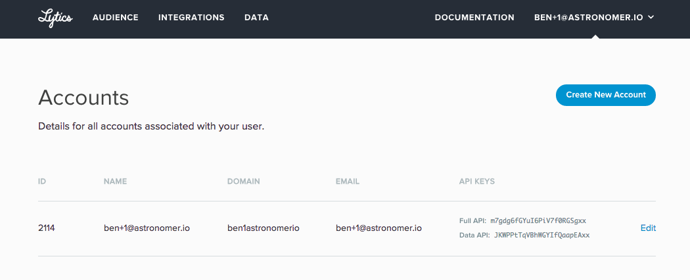
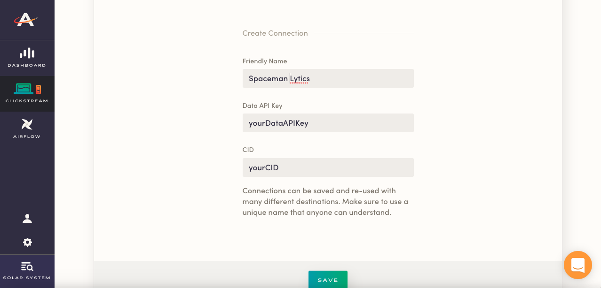
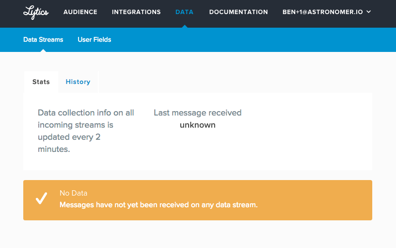

Astronomer Clickstream makes it easy to send your data to Lytics. Once you follow the steps below, your data will be routed through our platform and pushed to Lytics in the appropriate format.

## What is Lytics and how does it work?

Lytics is a customer data platform that helps brands orchestrate relevant marketing with built-in data science. Their customer platform makes it easy to build user profiles, build cross-channel campaigns, and predict behaviors with built-in machine learning.

Lytics crawls website text and images, automating digital catalogue and scoring of web content so that marketers can monitor and identify the most popular content and measure the likelihood of user return.

Lytics also enables drag-and-drop segmentation, which allows teams to target customers based on channel, revenue, growth, or at-risk status. Plus, Lytics independently integrates with more than 65 popular platforms like Twitter, AdRoll, and Google Ads.

***Notes:***

- Lytics collects its user data (name, email address) from a JavaScript library that you'd need to load on all pages of your site. This will power an in-app messaging feature and ensure you're not asking already-known users to opt in.

- All data is collected using the Lytics API, which will require a developer to learn and implement its methods and data structure.

[Learn more about Lytics](https://www.getlytics.com/)

## Why send data to Lytics using Astronomer Clickstream?

Integrating Lytics with Astronomer Clickstream means that you won't have to write any custom code on top of your standard Astronomer integration. Enabling Lytics in your Astronomer UI automatically loads the JavaScript library onto your site without making code changes.

Astronomer Clickstream automatically maps `page`, `identify`, and `track` calls directly to Lytics, which then uses that customer data to power its implementations.

***Note:** With Astronomer Clickstream you can also easily push data from mobile apps or servers to Lytics.*

## Getting Started with Lytics and Astronomer Clickstream

### Lytics Side

To get started sending events to Lytics, you'll need your:

- Data API Key
- Account ID

Once you have a Lytics account, you'll be dropped into a welcome page asking you to connect a few integrations.

Astronomer won't show up on that page, but go ahead and click on your email address at the top right, and into the `Manage Accounts` option.

Once there, you'll see your ID on the left hand side of your account and your Data API Key on the right.

### Astronomer Side

Add your Account ID and Data API Key into the Lytics connector on your Astronomer dashboard and give your new connection a unique name.

Now, just click `Create Destination` to activate your pipeline.

Lytics updates their incoming data stream every two minutes, so give it a couple of minutes for your events to show up.

See the image below - you can check back in on the status of your project by going to the `Data` tab at the top.

### Additional Features

* `Stream` - Allows you to organize your data in Lytics. This is only necessary when you are tracking multiple websites