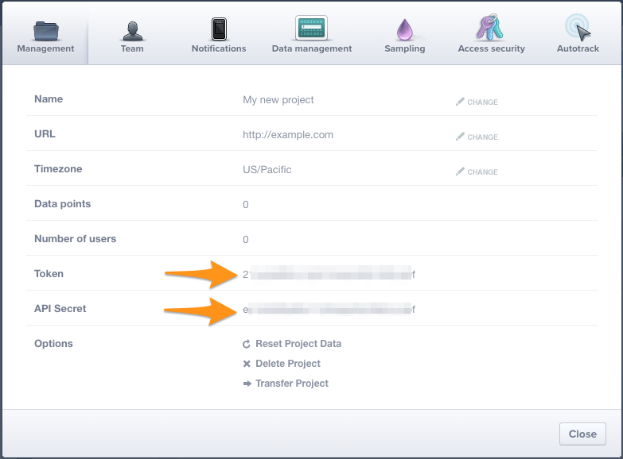

Astronomer Clickstream makes it easy to send your data to Mixpanel. Once you follow the steps below, your data will be routed through our platform and pushed to Mixpanel in the appropriate format. 

## What is Mixpanel and how does it work?

Mixpanel is a cross-channel product analytics tool that analyzes customer-driven event data.It then creates funnel reports so that marketers can identify user drop off or churn risk. 

Implementing Mixpanel involves building with two separate APIs, Mixpanel and Mixpanel People. In order to wokr with these APIs, you need to indicate which user traits and events that you want to be collected and send them to the appropriate SDKs. 

## Why send data to Mixpanel using Astronomer Clickstream?

Integrating Mixpanel with Astronomer Clickstream means that you don't need to work with any of Mixpanel's APIs or SDKs. Once you enable Mixpanel in your Astronomer UI, we'll route your data to Mixpanel in a format it understands so you can avoid its native implementation.

## Getting Started with Mixpanel and Astronomer Clickstream

To get started, create a Mixpanel account through their website. In your project settings, you will find your Token and API key.

You'll need to copy these two fields into the Astronomer App configuration for Mixpanel.

Add your Token and API key into the Mixpanel destination on your Astronomer dashboard and give your pipeline a unique name. Once you click 'Create Destination,' your pipeline will be activated.

Your data should start flowing almost immediately. Click on 'View Your Data' in the Mixpanel UI to start exploring!

On top of our standard calls, you're able to do a few extra things with our Mixpanel integration:
* Enable Mixpanel People: This makes it so that all of your analytics.identify() calls will get sent to Mixpanel's People.
    * You can then list the events you want to see in People in the "Events to Increment in People" text field
* Track additional pages, including
    * Named Pages
    * Categorized Pages
    * All Pages

