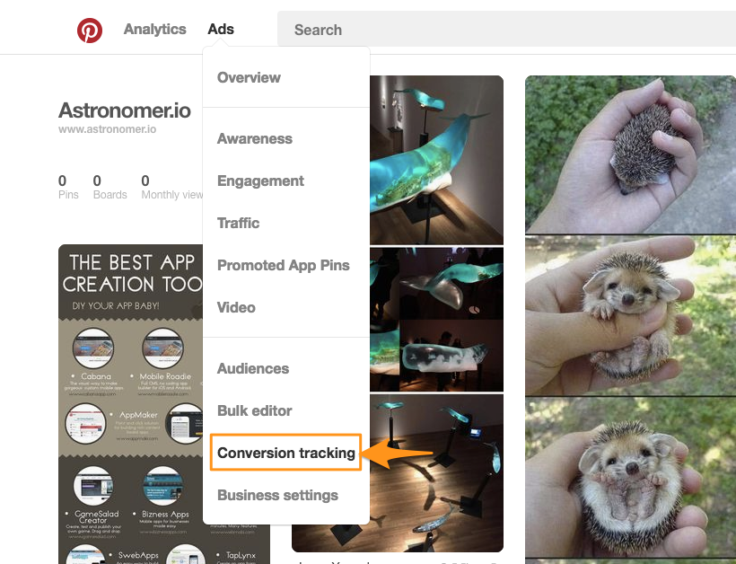
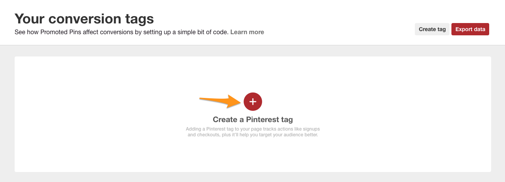
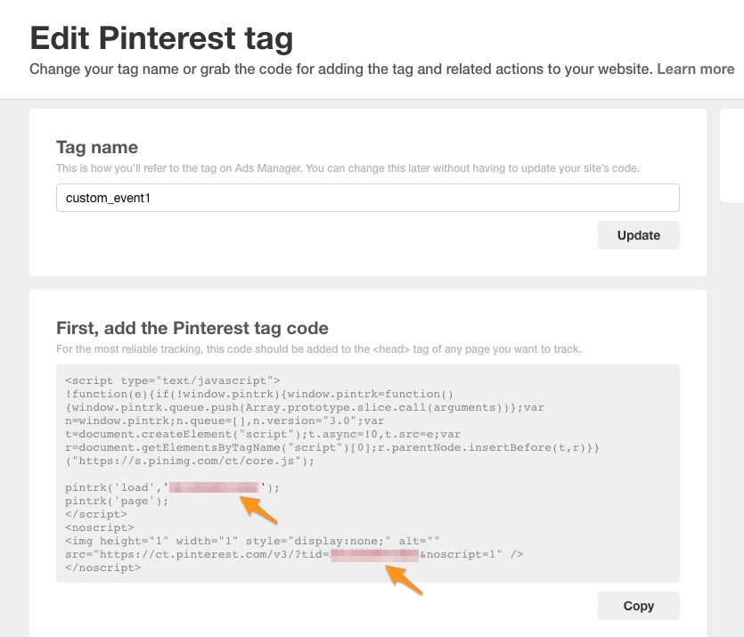
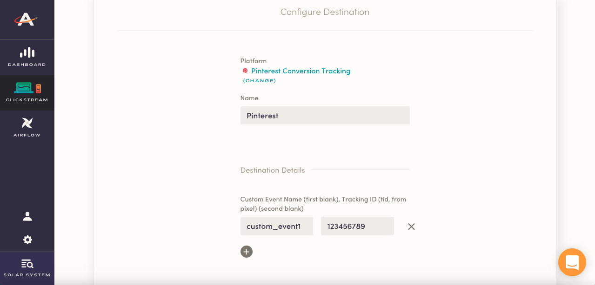

Astronomer Clickstream makes it easy to send your data to Pinterest Tag. Once you follow the steps below, your data will be routed through our platform and pushed to Pinterest Tag in the appropriate format.

## What is Pinterest Tag and how does it work?

Pinterst Tag is an ad management platform that creates JavaScript tags to track user actions once they click on or view an ad. In doing this, it is able to record website conversions tied to your specific ad campaigns. Using this platform enables audience targeting based on user behavior such as page views, videos watched, or orders completed. It also enables campaign optimization based on promoted pin performance and downstream user behavior such as products liked, shared, or purchased.

The Pinterest Tag allows you to track user events on your website after viewing your promoted Pin. You can then use this information to gauge the effectiveness of your ad campaign and create audiences to target on Pinterest. In order to use this tag, you must implement two separate components. First, you need to add JavaScript base code to every page of your website. Second, you need to add JavaScript event tracking code on specific pages where you want to track conversion events. You can provide additional information about an event by attaching an object that contains event data such as `value` or `quantity`. In order to do this, you'll have to hardcode values or pass them back dynamically.

[Learn more about Pinterest](https://business.pinterest.com/en)

## Why send data to Pinterest Tag using Astronomer Clickstream?

This integration can be very complicated to implement without Astronomer; the base code for each customer is unique and must be obtained from the Pinterest UI or API. If you want to track custom events, you'll need to familiarize yourself with the Pinterest API to both locate the correct base and event trackign code as well as install it correctly into your own site. It typically needs to be added by a webmaster or developer to prevent errors.

Using Astronomer, you can send page views and event data directly to Pinterest without needing to manually intsall any extra JavaScript on your website. Just enable the Pinterest destination in your Astronomer UI, and we'll automatically take care of mapping a standard set of events to recognized Pinterest Tag events. Astronomer also allows you to define and map your own events to supported Pinterest events without any custom code. All of this data is immediately available for analysis in your Pinterest dashboard.

Integrating Pinterest with Astronomer cuts out any need for additional implementation resources, saving your developer team valuable time.

## Getting Started with Pinterest Tag and Astronomer Clickstream

To get started sending events to Pinterest, first sign up for [Pinterest for Business](https://business.pinterest.com/en).

*Note*:  that this destination supports client-side analytics.js only.  You also need to have implemented Astronomer within your website prior to enabling this connector.

### Pinterest Side

Begin by logging into your [Pinterest for Business](https://business.pinterest.com/en) account. Create your conversion tracking tags by choosing from the `Ads` dropdown and selecting `Conversion Tracking.`

On the next page, choose `Create a Pinterest tag`.

Give your new tag a custom name, and choose `Next.` This next page will show your Pinterest conversion tag for that custom event name.

The generated Pinterest tag contains a value shown in red in two places. Copy this value.

*Note: we will fire `page` views for you, but you'll need to map in your custom events in order to fire those off.*

### Astronomer Side

Back in the Astronomer UI, select Pinterest Conversion Tracking as a destination and give your new Pinterest pipeline a unique name.

Then, provide your custom event name and paste the value for that event.

Finally, click `Create Destination` to activate your pipeline.

With that, you're all set! Get ready for insights.

### Things to note.

Generate page views and trigger your custom event inside your website with `analytics.track('your event name');`. You should see confirmation of those tags sent to Pinterest inside your Pinterest for Business dashboard, under `Conversion Tracking.`
