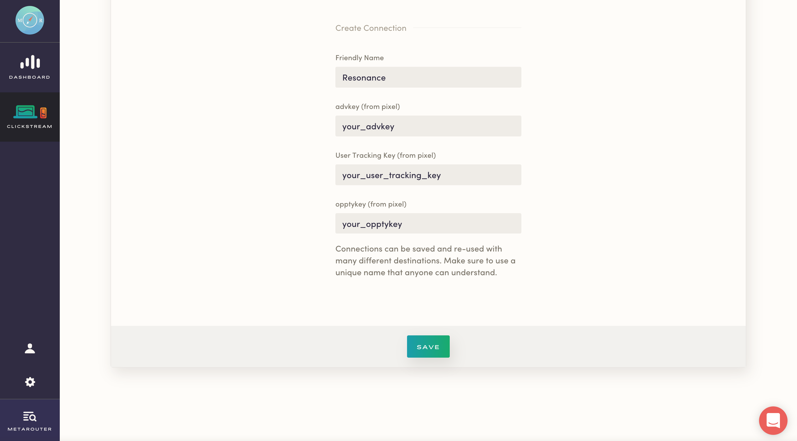

MetaRouter makes it easy to send your data to Resonate. Once you follow the steps below, your data will be routed through our platform and pushed to Resonate in the appropriate format.

## What is Resonate and how does it work?

Resonate is a customer intelligence tool that combines traditional market research, big data, data science, advanced analytics, and digital media activation all on a single platform.

Moving past traditional demographic and behavioral segments, Resonate conducts in-depth census-scale surveys of individual motivations and values. It also promotes customization by placing tags on your site, onboarding your existing CRM data, and allowing you to add your own queries.

Resonate's professional services offerings, data management platform integrations, and email marketing subscription service adds to their value-add in the customer intelligence space.

[Learn more about Resonate](https://www.resonate.com/)

## Why send data to Resonate using MetaRouter?

Integrating MetaRouter with Resonate will circumvent the need for manual implementation. More importantly, it will enrich the data you see in your Resonate dashboard and equip your team to better understand your customer base. Once your team has a better grasp of your customer base, it can effectively measure marketing performance and create engaging content.

## Getting Started with Resonate and MetaRouter

***Note:** This connector supports client-side analytics.js only.  You also need to have implemented MetaRouter [inside your website](../sources/analyticsjs.md) prior to enabling this connector.*

### Resonate Side

Once you sign up on [Resonate](https://www.resonate.com/), work with a Resonate professional services director to:

- Create your company's specific campaign
- Receive your page impression, identify, and tracking `` tags.

On that last note: Make sure you can identify which tags are page impression tags, and which are custom or conversion tags.

The tags will contain important parameters that you'll need.  The following parameters are the same for every tag: `advkey`, `opptykey`.  The `event key` is unique to each tag, and is shown as `my_event_key` below.  We take care of the `cache_buster`.

``` javascript

```

The identify tag is a bit different, and you can extract your `User Tracking Key` from here, shown as `user_tracking_key` below.

``` javascript


```

### MetaRouter Side

Copy your common tag parameters (`advkey`, `opptykey`), as well as your `User Tracking Key` from the identify tag,  and paste them into your MetaRouter Resonate configuration.  

Next, you'll need to provide your page impression tag event key, as well as any custom events and their respective event keys (shown as `evkey` in the snippet above).  

Give your new Resonate connection a name, and choose `Save`.



### Final Step.

Confirm with your Resonate professional services director that the `` tags for your specific campaign are being received as expected.
