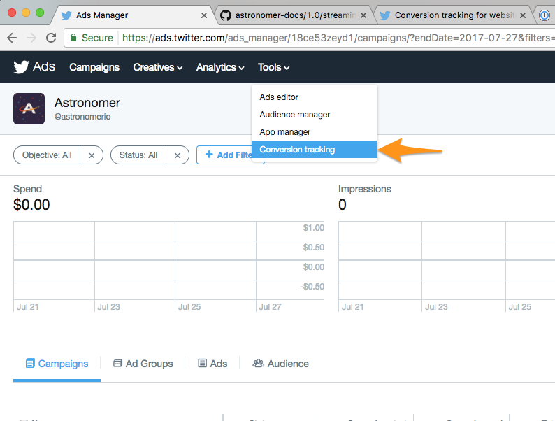
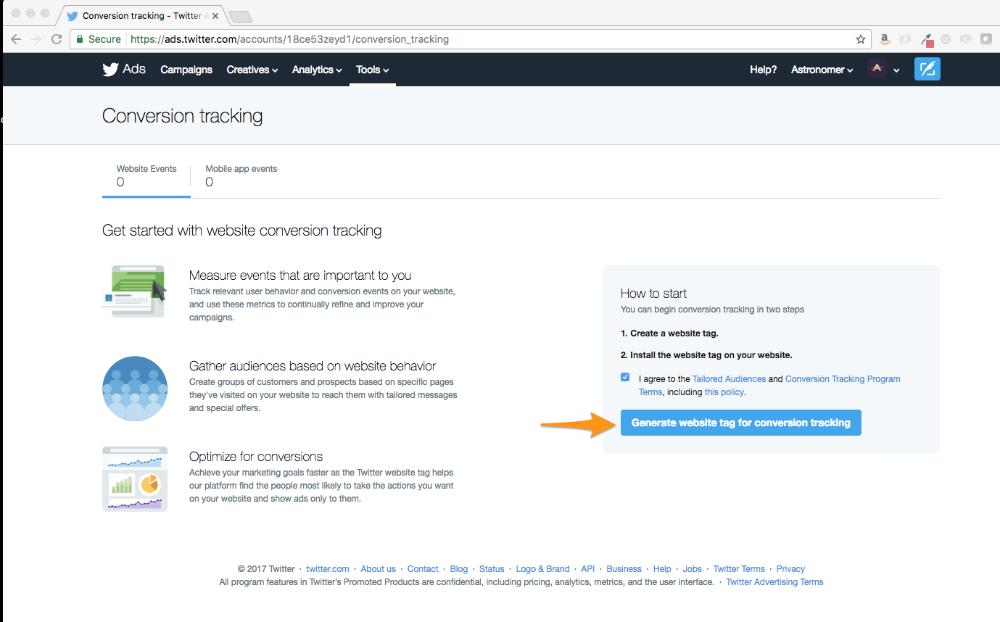
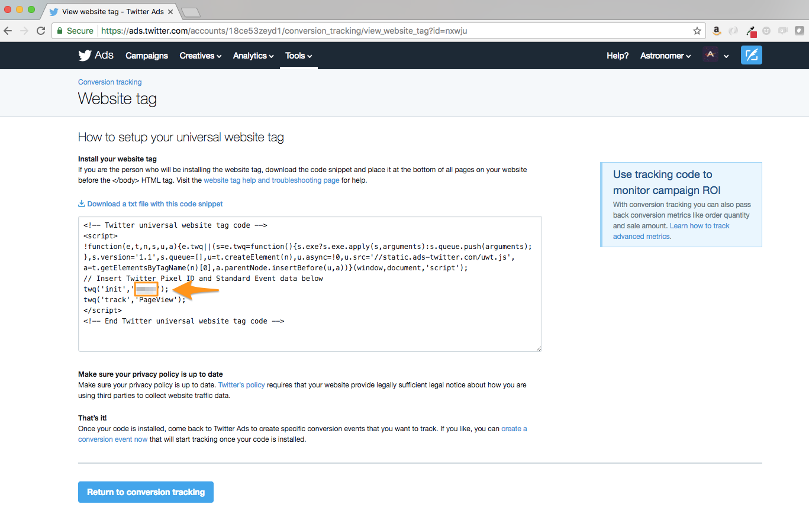
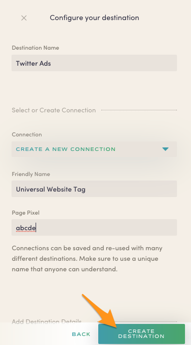
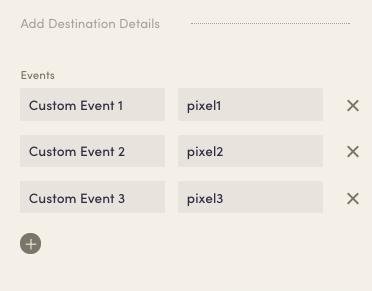

Astronomer Clickstream makes it easy to send your data to Twitter Ads. Once you follow the steps below, your data will be routed through our platform and pushed to Twitter Ads in the appropriate format.

## What are Twitter Ads and how do they work?

Twitter ads empower marketers to develop targeted ad campaigns on Twitter based on web visits, followers, engagement, and awareness.

With Twitter Ads, you pay for performance, target keywords, retarget engaged users, and tailor your audiences based on constraints such as language, gender, age, and geography. Plus, Twitter Ads automate new follower acquisition by targeting Promoted Accounts to audiences similar to current followers.

Using Twitter Ads requires adding a JavaScript code snippet to all your pages. In order to track more dynamic data like product searches, revenue, and product viewed, you'll need to add custom code on top of that snippet.

## Why send data to Twitter Ads using Astronomer Clickstream?

Sending Clickstream data to Twitter Ads will enrich the knowledge base that empowers your marketers with robust data about your user base.  

As soon as you activate the integration, Astronomer can load the Twitter ads script code to start recording page views. If you're already using our platform, you can map Twitter ad conversion IDs to those same event names to track them in Twitter Ads as well.

For ecommerce sites, you won't need to worry about creating custom code to track product browsing and checkout events - those events will be routed through Astronomer and sent directly to Twitter Ads.

## Getting Started with Twitter Ads and Astronomer Clickstream

To get started, all you need is your Twitter Pixel ID, which you can retrieve by creating a Twitter Ads conversion tracking website tag.

*Note: This connector supports client-side analytics.js only.  You also need to have instrumented Astronomer [inside your website](../sources/analyticsjs.md) prior to enabling this connector.*

### Twitter Side

**Generate your Universal Website Tag**

Once you have a [Twitter Ads account](https://ads.twitter.com/),  choose `Conversion Tracking` from the `Tools` drop down menu.

A page will load asking you to accept Twitter Ads' conversion tracking policy. If you agree, check that box and choose `Generate website tag for conversion tracking.`

You'll be taken to a page with instructions on how to set up your universal website tag, along with a code snippet.

**Generate your Universal Tag Pixel ID**

If you want to use the universal tag, simply copy your Twitter Pixel ID from the code snippet (identified below).

*Reminder:* Twitter doesn't recognize custom events, just pixel IDs. Anytime that you `analytics.track(event, properties)` an event that represents a Twitter conversion, you need to map the event name on the left to its corresponding Twitter Pixel ID on the right.  

**Single Event Website Tags**

If you want to use Single Event Website Tags, you'll have to map the Astronomer events to your tags' respective conversion pixel IDs.

If your events don't match the event names you're receiving from Astronomer that have the Universal Website Tag, you'll want to use the *Single Event Website Tags*.

*Note:* Twitter Ads only work with our client-side JavaScript library `analytics.js` since it requires its script or pixel to be loaded onto your website.

### Astronomer Side.

Paste your Twitter Pixel ID into the `Page Pixel` field in your Astronomer Twitter Ads configuration, and give your new connection a unique name. Click 'Create Destination' and your pipeline will be activated.

If you’d like to use the Single Event Website Tags, you must map the event names to your Single Event Website Tags’ respective conversion pixel IDs.

### Final Step.
You should now be able to refresh your website and see the Twitter Ads pixel firing for page views.

If you're using Single Event Website Tags and have those mapped in, you should see specific pixels fire when triggering your respective events.

 For example, `analytics.track("Custom Event 1");`, based on the input above, would fire the Twitter Ads pixel `pixel1`, on so on.
