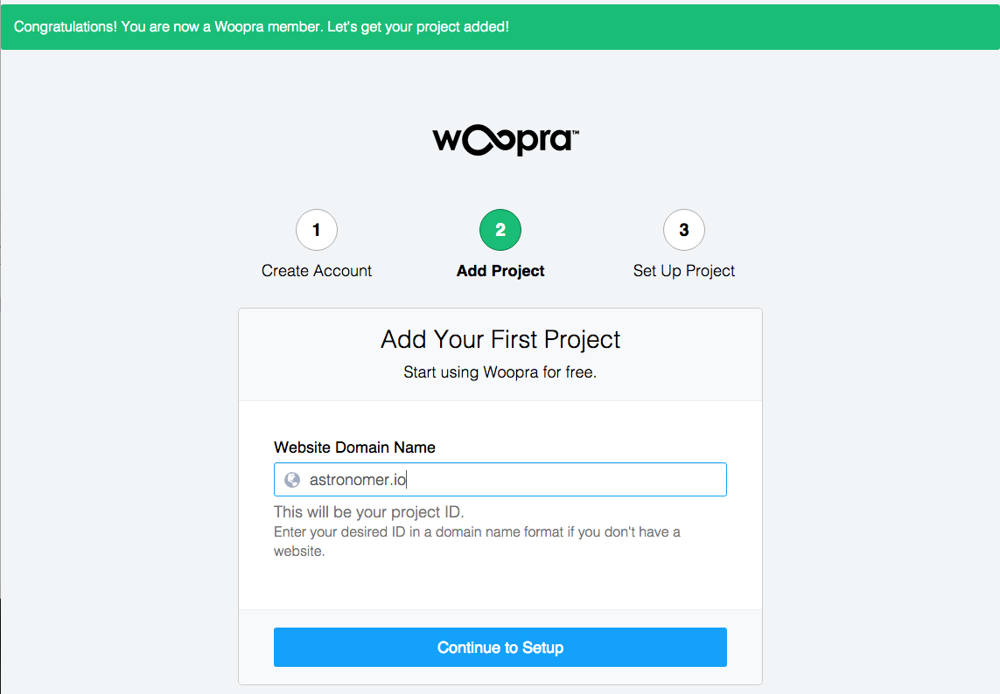
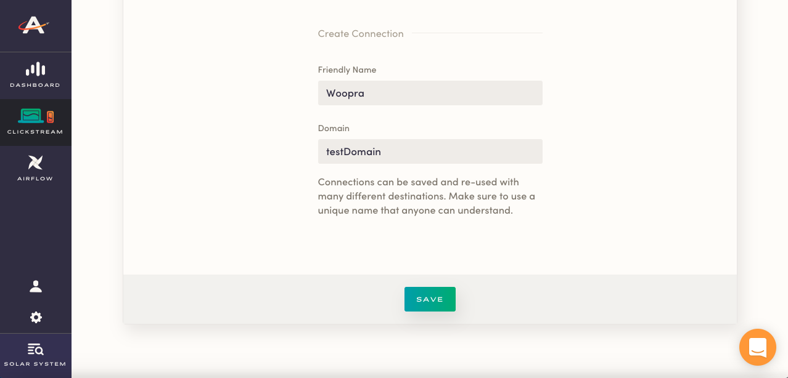
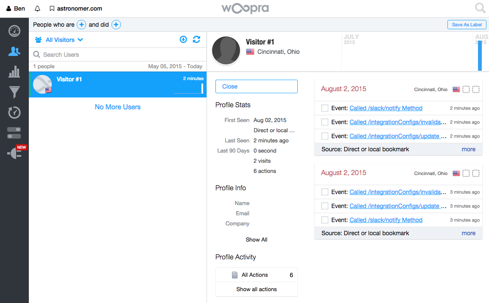

Astronomer Clickstream makes it easy to send your data to Woopra. Once you follow the steps below, your data will be routed through our platform and pushed to Woopra in the appropriate format. 

## What is Woopra?

Woopra is a real-time customer analytics platform that tracks your customers' web and mobile activity,forms, emails, and support tickets. The platform allows you to build audience profiles and automatically sync that data to your system as customer behavior changes in real-time. Plus, Woopra can seamlessly integrate with third-party apps - automating prioritization based on support requests as well as targeted, custom content. 

## Why send data to Woopra using Astronomer Clickstream

Astronomer's integration can collect and transform data you receive from Woopra directly from your existing mobile and server-side integrations on Astronomer Clickstream. That way, there's no need to include any Woopra SDK's in any of your applications. 

Combining Woopra's data with the data you receive from other third-party tools on Astronomer Clickstream will empower your team to better understand customer behavior and more effectively target content.


## Getting Started with Woopra and Astronomer Clickstream

### **Woopra-Side**

Once you create your account on the woopra [website](https://www.woopra.com/), add a new project with the domain of your website or app. 





### **Astronomer-Side**

Add your domain name into the Woopra connector on your Astronomer dashboard and give your new connection a unique name. 

Click `Create Destination` and your pipeline will be activated.




### **The Pipeline.**

You'll now see your events trickling in on your Woopra account. If you click on the `People` icon on the left hand side of the dashboard, you'll see 1 new user. That's you!

Click on that new user to see the history of events being recorded.



## Beyond the Basics

### **Tying server side events to client side sessions**

Pass us the `wooTracker` value inside your cookie if you want your server side events to be seen as part of the same "source" or session as your client side events. 

To retrieve this value, input the following command: 

```
analytics.ready(function(){
  var woopraCookie = window.woopra.cookie;

  // pass this value to your server
});
```

From the server side, you can attach it to the `integrations.Woopra.cookie` property. Here's a Ruby example that will let Woopra know that this server side event is part of the same session as the client. 

```
Analytics.track(
    user_id: '019mr8mf4r',
    event: 'Purchased Item',
    properties: { revenue: 39.95, shipping: '2-day' },
    integrations: {
      Woopra: {
       cookie: <wooTracker value>
      }
    })
```


